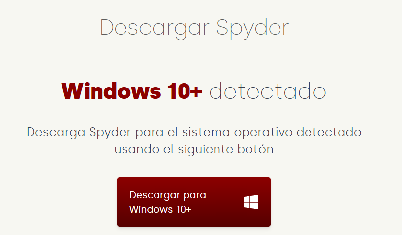

# Punto 1: Instalación de entornos de desarrollo, propietarios y libres.

## IDEs utilizados.
- **IDE 1:** Pycharm
- **IDE 2:** Spyder IDE (faltan las versiones)

## Descripción de la tarea.
Elegir 2 entornos de desarrollo, instalar ambos en el equipo y hacer capturas de pantallas del proceso de instalación.

## Respuestas a preguntas evaluativas.
### Pregunta 1: ¿Qué diferencias encontraste en el proceso de instalación entre el IDE propietario y el libre?

### Pregunta 2: ¿Qué ventajas identificaste en cada uno de los entornos durante la instalación?

## Evidencias.

## Observaciones.