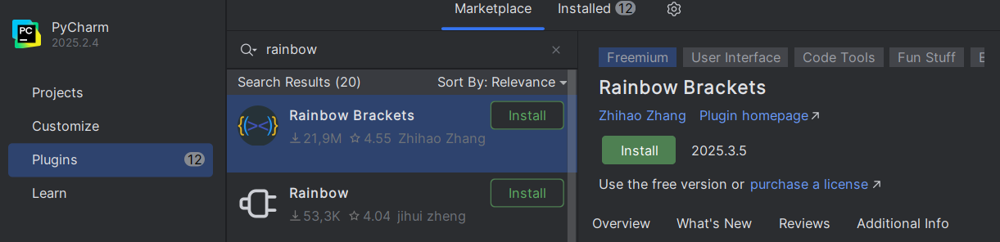
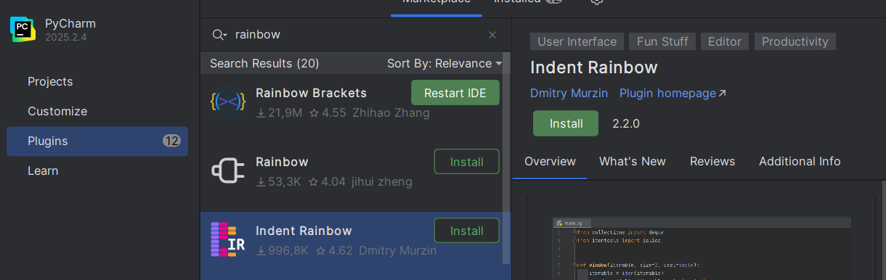
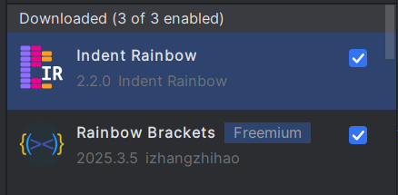
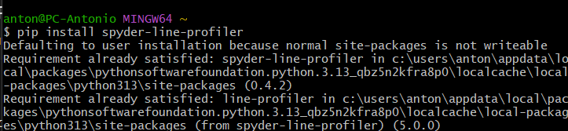
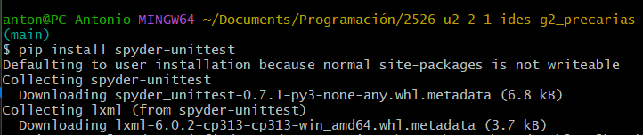
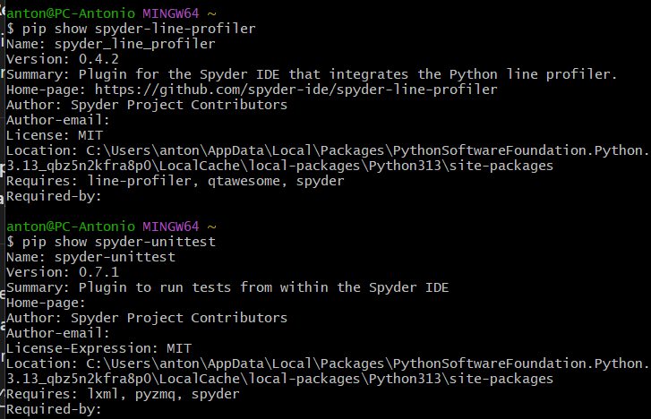

# Punto 2: Gestión de módulos y extensiones en el entorno de desarrollo.

## IDEs utilizados.
- **IDE 1:** Pycharm 25.2.4
- **IDE 2:** Spyder IDE 6.1.0

## Descripción de la tarea.
Instalación de extensiones a los IDEs.

## Respuestas a preguntas evaluativas.
### Pregunta 1: ¿Cómo fue el proceso de instalación de extensiones o módulos en cada IDE?
En Pycharm fue mucho más sencillo que en Spyder, ya que en el mismo IDE te trae para instalarlo, y en el Spyder hace falta ir a la terminal y saber exactamente como se llama la extensión para instalarla.

### Pregunta 2: ¿Qué beneficios proporcionan las extensiones o plugins que instalaste para el desarrollo de tus proyectos?
En Pycharm instalé 2 que sirven para visualizar mejor el código, añadiendo colores a las indentaciones y a los corchetes, paréntesis y demás. Y por otro lado, en Spyder instalé uno que mide el rendimiento del código, es decir, cuanto tarda en ejecutarse cada línea dentro de la función y otro que sirve para probar automáticamente el código y verificar que funciona como se espera, detectando automáticamente los archivos de test.

## Evidencias.
### Pycharm
Para instalar extensiones en Pycharm, hay que entrar en los Plugins y en el MarketPlace, ahí ya buscar lo que queremos instalar.
- Rainbow Brackets es para que coloree los parentesis, llaves y corchetes de diferentes colores

- Indent Raibow sirve para que en cada indentación se marque de un color diferente

- Aquí la comprobación de que ambas extensiones han sido instaladas

### Spyder IDE
Para instalar cosas en spyder se hace desde la terminal y con pip instalar lo que queremos, reiniciando spyder para ver los cambios hechos.
- Spyder Line Profiler sirve para realizar un perfilado detallado por línea de código, por ejemplo para identificar cuellos de botella en funciones específicas.

- Spyder-Unittest integra un panel de pruebas (testing) para ejecutar y visualizas test como pytest o 

- Aquí la comprobación de que están instaladas
