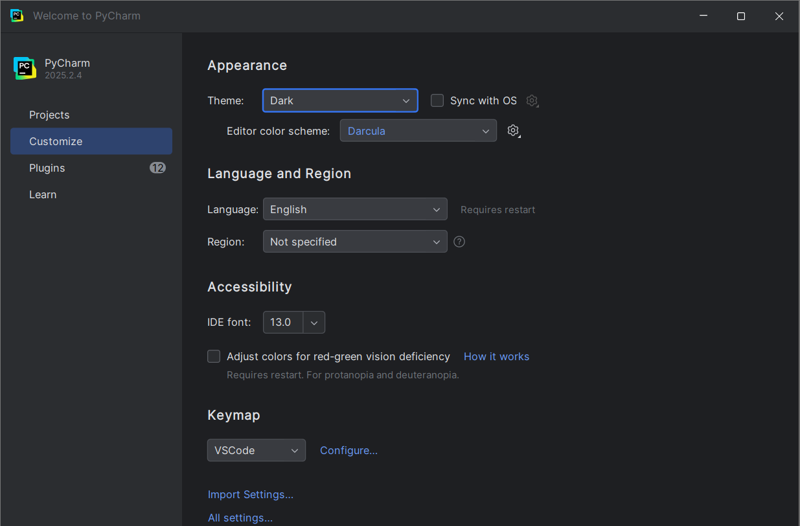
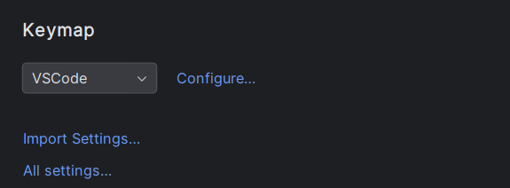
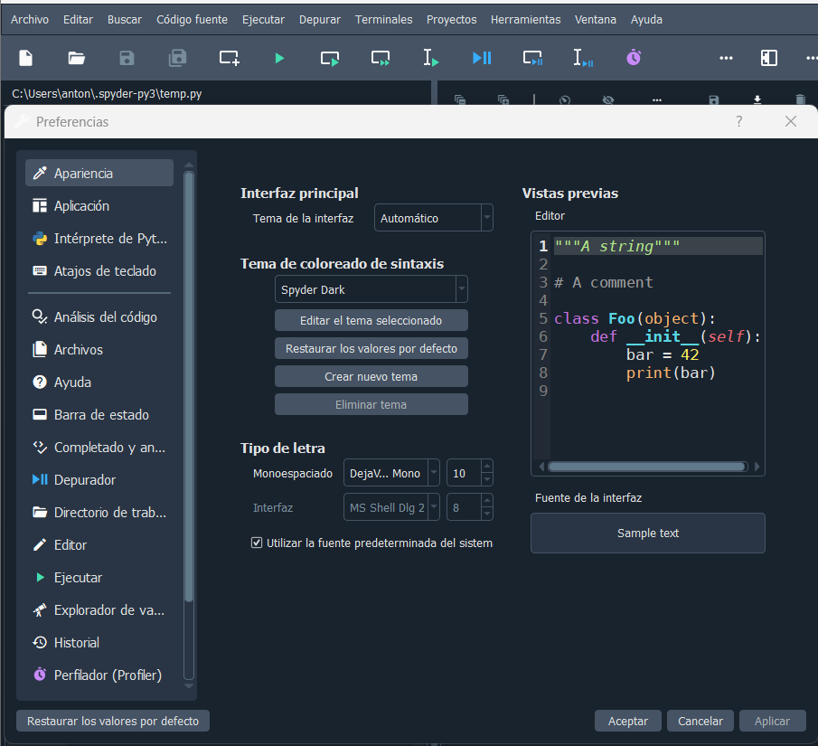
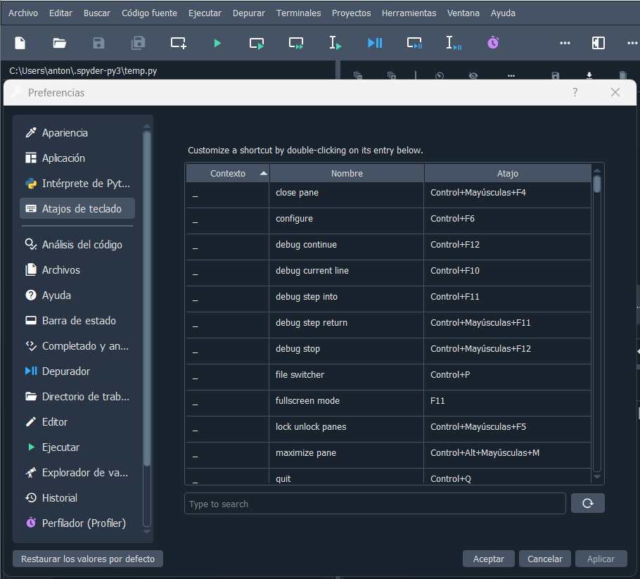

# Punto 3: Personalización y automatización del entorno.

## IDEs utilizados.
- **IDE 1:** Pycharm 25.2.4
- **IDE 2:** Spyder IDE 6.1.0

## Descripción de la tarea.
Personalización del entorno de cada IDE (tema, atajos de teclado) y automatización de una tarea como la ejecución de pruebas o la compilación de un código.

## Respuestas a preguntas evaluativas.
### ¿Qué aspectos del entorno personalizaste y cómo mejoró tu experiencia de desarrollo?
Personalicé la apariencia para ponerla oscura, ya que no me gusta como se ve el fondo claro

### ¿Cómo configuraste la automatización de tareas y en qué te benefició durante el trabajo?

## Evidencias.
### Pycharm
En Pycharm para los temas en Customize, y ahi lo personalizamos como queramos

Para los atajos de teclados se pueden importar los de otro lado como Visual Studio en el keymap o configurarlos en el Configure

### Spyder IDE
En Spyder para los temas es en Herramientas/Preferencias y dentro en Apariencia podremos modificarlo como más nos guste.

Y para los atajos de teclado donde mismo pero en Atajos de teclado.

## Observaciones