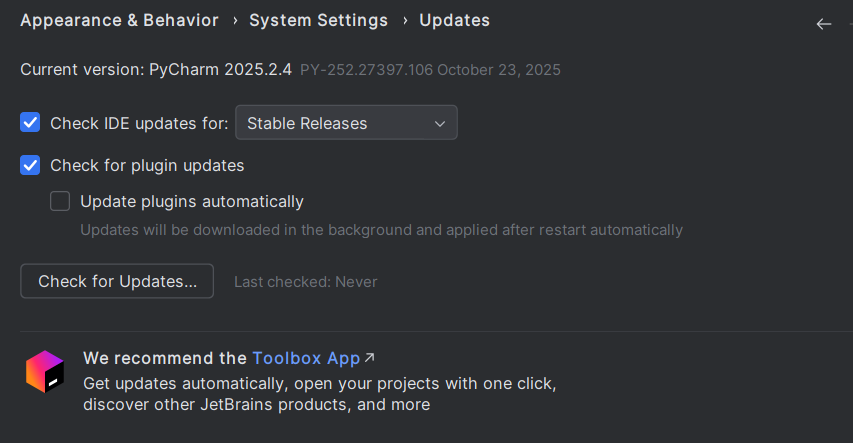

# Punto 4: Configuración del sistema de actualización del entorno de desarrollo

## IDEs utilizados.
- **IDE 1:** Pycharm 25.2.4
- **IDE 2:** Spyder IDE 6.1.0

## Descripción de la tarea.
Configurar las actualizaciones automáticas o manuales en ambos IDE.

## Respuestas a preguntas evaluativas.
### Pregunta 1: ¿Cómo configuraste las actualizaciones automáticas en cada IDE?
En Pycharm las configuré fácilmente, ya que al entrar en los ajustes y buscar el apartado de "Updates" se podía configurar fácilmente. Por otro lado Spyder no tiene la opción para ser actualizado automáticamente, tiene que ser hecho a mano todo.

### Pregunta 2: ¿Por qué es importante mantener el IDE actualizado en proyectos de desarrollo?
Porque pueden haber errores y fallos en versiones anteriores que han sido corregidos en nuevas versiones, además, que pueden haber problemas de compatibilidad con nuevas versiones de lenguajes y librerías.

## Evidencias.
### Pycharm
En Pycharm se hará desde los ajustes, esto es bastante sencillo y podremos elegir si queremos que nos avise antes de actualizar o que lo actualice sin decirnos nada.

### Spyder IDE
En spyder IDE no se pueden poner actualizaciones automáticas, por lo que cada vez que se quiera actualizar habrá que instalar el .exe desde la web de Spyder.