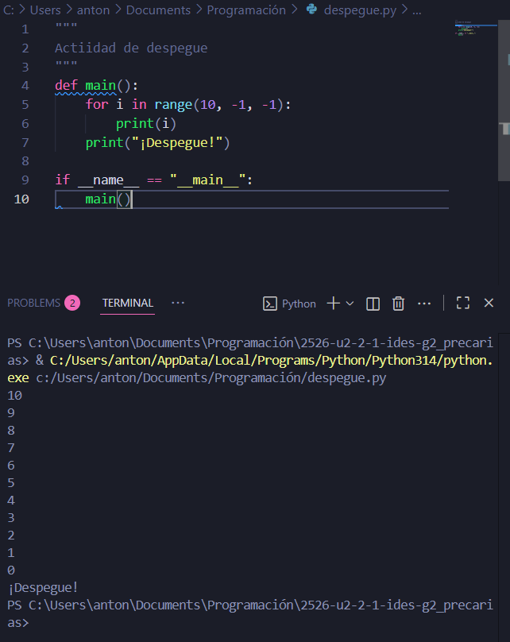
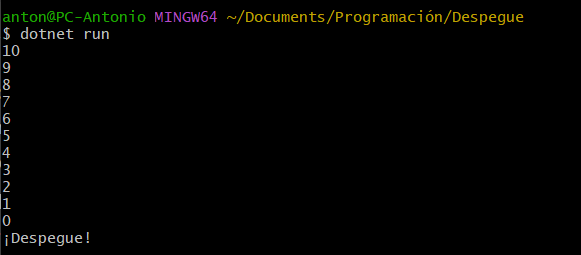

# Punto 5: Generación de ejecutables a partir de código fuente en distintos lenguajes en un mismo IDE

## IDEs utilizados.
- **IDE 1:** Visual Studio Code

## Descripción de la tarea.
Escribir un programa que cuente de 10 a 0 y luego imprima "¡Despegue!" usando solo un IDE para generar y ejecutar el programa en dos lenguajes diferentes.

## Respuestas a preguntas evaluativas.
### Pregunta 1: ¿Cuál fue el proceso para ejecutar el mismo programa en diferentes lenguajes dentro del mismo IDE?
Para python fue igual que siempre, escribir el código y luego ejecutarlo en la terminal. Para C# se han tenido que instalar .NET SDK para poder hacerlo, luego he tenido que crear un proyecto y ya de ahi modificar el archivo creado y poner el dotnet run dentro de la carpeta.

### Pregunta 2: ¿Qué diferencias encontraste en la generación del ejecutable entre los dos lenguajes?
Que en python es mucho más fácil que en C#, ya que hay que instalar más cosas y esperar a que se compile cuando en python lo hace sin tener que compilar

## Evidencias.
Despegue en Python

Despegue en C#
