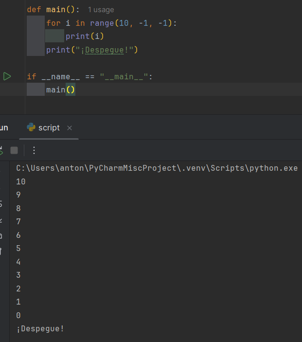
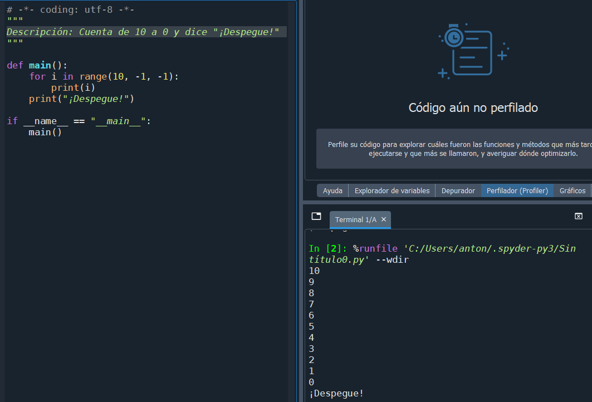

# Punto 6: Generación de ejecutables con diferentes IDEs a partir del mismo código fuente

## IDEs utilizados:
- **IDE 1:** Pycharm 25.2.4
- **IDE 2:** Spyder IDE 6.1.0

## Descripción de la tarea.
Escribir un programa en Python que cuente de 10 a 0 y luego imprima "¡Despegue!" ejecutando el programa en ambos IDEs.

## Respuestas a preguntas evaluativas.
### Pregunta 1: ¿Qué diferencias encontraste al ejecutar el mismo código fuente en diferentes IDEs?
No he encontrado ninguna diferencia notable, solo que es diferente el crear los archivos, por lo demás no.

### Pregunta 2: ¿Cuál de los IDEs te pareció más cómodo o eficiente para ejecutar el código Python o el lenguajes que hayas elegido? ¿Por qué?
El Spyder, porque al crear el archivo ya viene completamente la base del programa con lo que creamos antes. En Pycharm se puede hacer la macros pero hay que ejecutarla.

## Evidencias.
### Pycharm

### Spyder IDE
