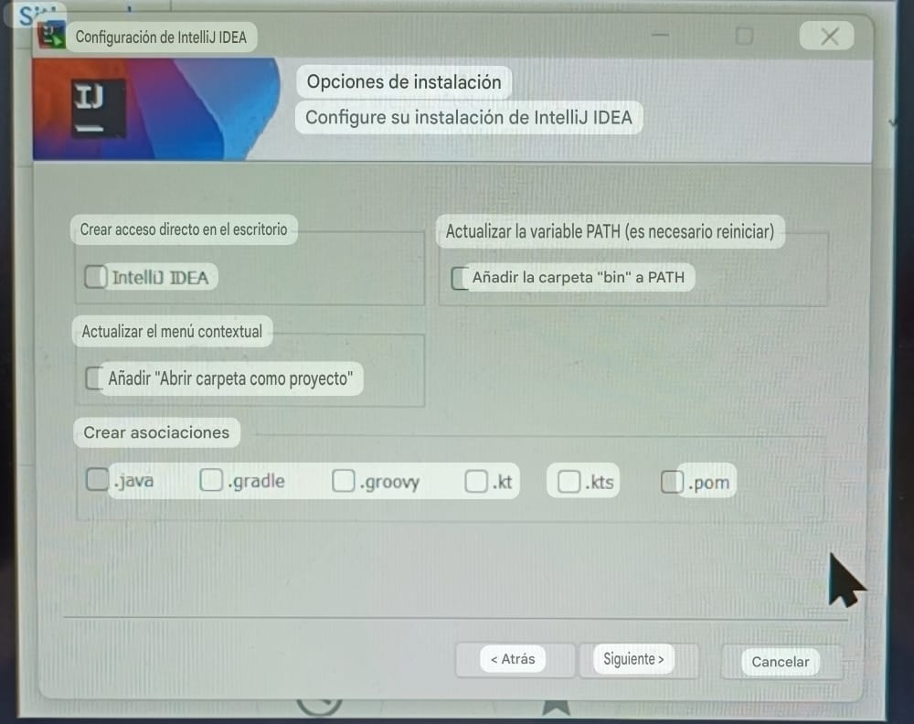
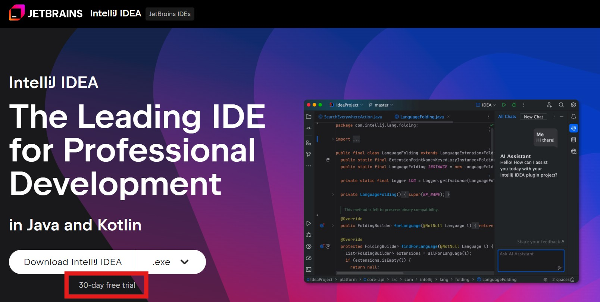
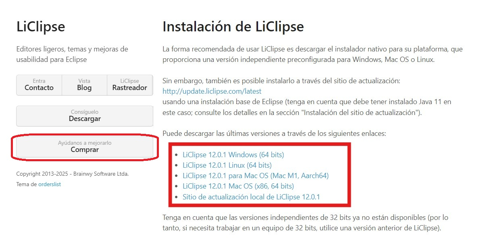

# Punto 1: Instalación de entornos de desarrollo, propietarios y libres

  

## IDEs utilizados

-  **IDE 1:** IDE propietario **IntelliJ IDEA Ultimate** -
    Versión: IntelliJ IDEA 2025.2.4 

-  **IDE 2:** IDE libre - **LiClipse** - 
    Versión : 12.0.1.

## Descripción de la tarea
**Respuesta:**

>Para el proceso de instalacion de los dos (2) IDES untilice un motor de busqueda y escribi los respectivo nombre de los IDE
* *IntelliJ IDEA Ultimate*" 
* *LiClipse*

>en el sistemas operativo que uso es *windows 11* siendo asi que tuvo que selecion la opcion de descarga de ___windows 64bit___

## Respuestas a preguntas evaluativas

### Pregunta 1: ¿Qué diferencias encontraste en el proceso de instalación entre el IDE propietario y el libre?

  

>La diferencia que note a primera mano es que, en el caso del **IDE propietario IntelliJ IDEA Ultimate**, se especifica que solo tendrá una **prueba de 30 días**.

>En cambio, el **IDE libre LiClipse** solo muestra un pequeño recuadro que sugiere que, si queremos ayudar, podemos comprarlo.
Lo siguiente que noté fue el **peso del archivo de instalación :** 

  
  
|IDE | Peso  |
|--|--|
|**IntelliJ IDEA Ultimate**| 1,33gb |
| **LiClipse**             |181 mb  |

### Pregunta 2: ¿Qué ventajas identificaste en cada uno de los entornos durante la instalación?

>**LiClipse** es más ligero para su descarga y su instalación es más rápida.
Sin embargo, la instalación de **IntelliJ IDEA Ultimate** tarda un poco más, aunque es más completa.
Durante el proceso, el asistente de instalación nos solicita algunas especificaciones o  como **actualizar la variable PATH**, añadir la carpeta “bin” al PATH o crear algunas asociaciones.
  

## Evidencias

**IntelliJ IDEA Ultimate**

**LiClipse**

  

## Observaciones

| Requisito | **IntelliJ IDEA Ultimate** | **Eclipse IDE** |
|------------|-----------------------------|-----------------|
| **Sistema operativo** | Windows 10 (1809) o posterior / Windows Server 2019+ | Windows 10 o posterior |
| **Arquitectura** | 64 bits (x86_64 o ARM64) | 64 bits |
| **Procesador** | Múltiples núcleos recomendados | Cualquier CPU moderna |
| **Memoria RAM** | Mínimo 8 GB (recomendado 16 GB) | Mínimo 1 GB (recomendado 4 GB) |
| **Espacio en disco** | ~10 GB libres | ~1 GB libre |
| **Java (JDK/JRE)** | Incluido (no requiere instalación aparte) | Requiere JDK 11 o superior |
| **Resolución de pantalla** | Mínimo 1024×768 (recomendado 1080p) | Mínimo 1024×768 |

>Como **liclipse** basado en Eclipse, diseñado para ser más ligero, rápido y fácil de usar, **liclipse** requiere menos recusos hardware  que el **IntelliJ IDEA Ultimate** , pero **IntelliJ IDEA Ultimate** es mas completo 
