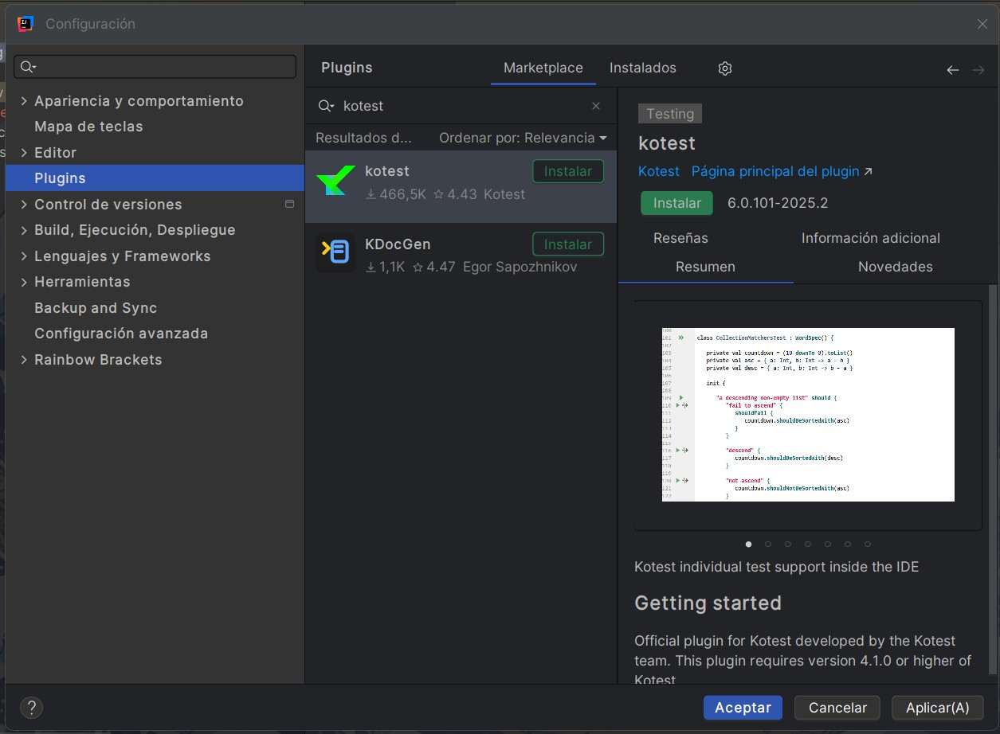

# Punto 2: Gestión de módulos y extensiones en el entorno de desarrollo

## IDEs utilizados

-  **IDE 1:** IDE propietario **IntelliJ IDEA Ultimate** -
    Versión: IntelliJ IDEA 2025.2.4 

-  **IDE 2:** IDE libre - **LiClipse** - 
    Versión : 12.0.1

## Descripción de la tarea

Instalacion de plugins en **LiClipse** 

>**(Babel Language Pack):**
Este plugin traduce gran parte de la interfaz (menús, cuadros de diálogo, mensajes).

Pasos:
* Abre LiClipse.
* Ve a Help → Install New Software...
* En el campo Work with: escribe:
https://download.eclipse.org/technology/babel/update-site/latest/

## Respuestas a preguntas evaluativas

### Pregunta 1: ¿Cómo fue el proceso de instalación de extensiones o módulos en cada IDE?

>Fue una experiencia llena de enojo y frustración. El proceso es supremamente complejo. Tiempo invertido: 2:30 (dos horas y media). ya que la marketplace eclipse no funciona 

>en un princio se salia un un mensaje que decia que habia error con la lectura con el XML 
realice los siente paso:

* Verifica tu conexión y proxy
* Cambia el endpoint del Marketplace
* Borra la caché del Marketplace
* Cambiar configuración de red
* Verificar la URL del Marketplace

> No funcionaron estos metodos y la altenativa que me encontre fue ingresar diretatamente ha: 

https://marketplace.eclipse.org/

> realizar una una busqueda clasica del plugins solicitado **pero** , 

>Babel es un proyecto independiente mantenido por la comunidad, no por Eclipse, por eso no está en el Marketplace.

>Se instala mediante un update site, una URL desde la que Eclipse o LiClipse descargan las traducciones directamente. Cada versión de Eclipse tiene su propio paquete, y usar Marketplace sería complicado para mantener la compatibilidad.

> demás, el update site es más flexible y confiable para este tipo de plugins.

Instalacion de plugins en **IntelliJ IDEA Ultimate** 

### **Opción 1: Desde el propio IDE (la más común)**

1.  **Abre IntelliJ IDEA**.
    
2.  Ve a **File → Settings** (o **Ctrl + Alt + S**).
    
3.  En el menú de la izquierda, entra a **Plugins**.
    
4.  En la pestaña **Marketplace**, busca el plugin que quieras (por nombre).
    
5.  Pulsa **Install**.
    
6.  Cuando termine, **reinicia IntelliJ IDEA** para activar el plugin.

### Pregunta 2: ¿Qué beneficios proporcionan las extensiones o plugins que instalaste para el desarrollo de tus proyectos?

>mayor comprecion del entorno de trabjo y facilidad de navegacion para el usuario 

## Evidencias

## Observaciones
> leer con cuidado y paso a paso 