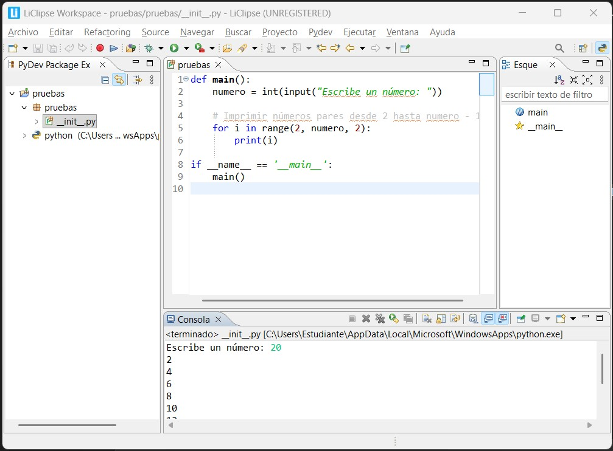

# Punto 2: Gestión de módulos y extensiones en el entorno de desarrollo

## IDEs utilizados

-  **IDE 1:** IDE propietario **IntelliJ IDEA Ultimate** -
    Versión: IntelliJ IDEA 2025.2.4 -- 21.0.8+1-b1038.73 amd64 (JCEF 122.1.9)

-  **IDE 2:** IDE libre - **LiClipse** - 
    Versión : 12.0.1.202502081502

## Descripción de la tarea

Instalacion de plugins en **LiClipse** 

>**(Babel Language Pack):**
Este plugin traduce gran parte de la interfaz (menús, cuadros de diálogo, mensajes).

Pasos:
* Abre LiClipse.
* Ve a Help → Install New Software...
* En el campo Work with: escribe:
https://download.eclipse.org/technology/babel/update-site/latest/

## Respuestas a preguntas evaluativas

### Pregunta 1: ¿Cómo fue el proceso de instalación de extensiones o módulos en cada IDE?

>Fue una experienca llena de enojo y frustacion 
Siendo que es proceso es supremamente complejo
tiempo invertido **2:30 (2 hora y media )**

>en un princio se salia un un mensaje que decia que habia error con la lectura con el XML 
realice los siente paso:

* Verifica tu conexión y proxy
* Cambia el endpoint del Marketplace
* Borra la caché del Marketplace
* Cambiar configuración de red
* Verificar la URL del Marketplace

> No funcionaron estos metodos y la altenativa que me encontre fue ingresar diretatamente ha :

https://marketplace.eclipse.org/

> realizar una una busqueda clasica del plugins solicitado **pero** , 

>Babel es un proyecto independiente mantenido por la comunidad, no por Eclipse, por eso no está en el Marketplace.

>Se instala mediante un update site, una URL desde la que Eclipse o LiClipse descargan las traducciones directamente. Cada versión de Eclipse tiene su propio paquete, y usar Marketplace sería complicado para mantener la compatibilidad.

> demás, el update site es más flexible y confiable para este tipo de plugins.

### Pregunta 2: ¿Qué beneficios proporcionan las extensiones o plugins que instalaste para el desarrollo de tus proyectos?

>mayor comprecion del entorno de trabjo y facilidad de navegacion para el usuario 

## Evidencias

## Observaciones
> leer con cuidado y paso a paso 