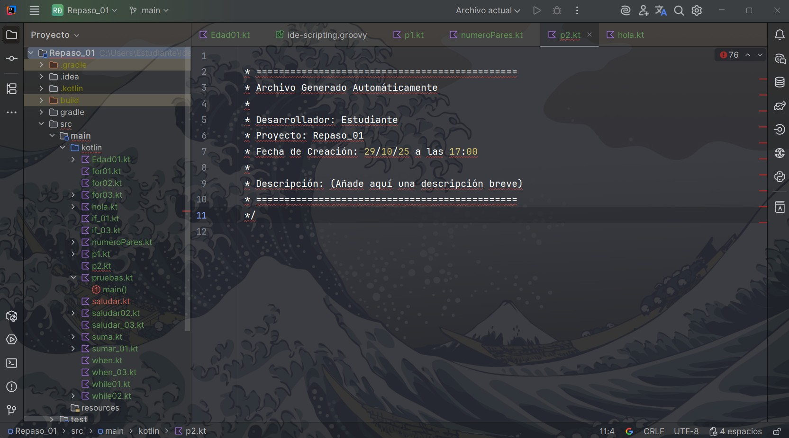

# Punto 3: Personalización y automatización del entorno

## IDEs utilizados

-  **IDE 1:** IDE propietario **IntelliJ IDEA Ultimate** -
    Versión: IntelliJ IDEA 2025.2.4 -- 21.0.8+1-b1038.73 amd64 (JCEF 122.1.9)

-  **IDE 2:** IDE libre - **LiClipse** - 
    Versión : 12.0.1.202502081502

## Descripción de la tarea

En **IntelliJ IDEA Ultimate**

>**Key Promoter X**: Este plugin te ayuda a aprender y usar mejor los atajos de teclado, acelerando la automatización de acciones dentro del IDE.
​ 

>**Rainbow Brackets**: Facilita la gestión visual de bloques de código por colores, algo muy útil en pruebas automatizadas y depuración

>**Translation:** El plugin de traducción más popular para IntelliJ IDEA 

>**comandos**
Abrir Diálogo de Traducción	 // Ctrl + Shift + O//

**LiClipse**

>**PyDev**: Es el plugin esencial si trabajas con Python. Ofrece autocompletado, análisis de código, y admite depuración.

### Personalizaciones realizadas
- Tema: aprendisaje de teclado de atajos
- Atajos de teclado: sugeridas por el plugin

## Respuestas a preguntas evaluativas

### Pregunta 1: ¿Qué aspectos del entorno personalizaste y cómo mejoró tu experiencia de desarrollo?

>En el caso de  **IntelliJ IDEA Ultimate** la personalizacion de **Rainbow Brackets** me ayuda a identificar todas bloque  y llaves que pertenecen 

> me ayuda ha  enterder mas el entrono donde estoy trabajando y los mensaje de error 

### Pregunta 2: ¿Cómo configuraste la automatización de tareas y en qué te benefició durante el trabajo?

El proceso de automatizacion que logre fue la de  de *Plantillas de Archivos y Código* 

### la configuracion 
Ve a Archivo > Configuración

Navegar a Plantillas:

En el panel lateral, busca y haz clic en Editor > Plantillas de Archivos y Código.

Seleccionar la Plantilla:

> Ingles 

File Templates Configuration (Configuración de Plantillas de Archivo)
Abrir la Configuración:

Ve a File > Settings

Navegar a Plantillas:

En el panel lateral, busca y haz clic en Editor > File and Code Templates.

Seleccionar la Plantilla:

Busca y selecciona la plantilla para el tipo de archivo que quieres modificar (por ejemplo, Java Class, Kotlin File, HTML File, etc.)

### Beneficios 
El beneficio directo es poder tener un seguimiento, ya que se genera y registra la fecha y hora de creación del archivo .tk, con la opción de poder ampliar esta plantilla con código o estructuras más precisas."

## Evidencias
**ANTES:**

**Rainbow Brackets**

**DESPUÉS:**

![Rainbow Brackets]

**AUTOMATIZACIÓN:**

## Observaciones

La personalización es importante para lograr un entorno de trabajo más cómodo y ágil, aunque no es un requisito indispensable."

"Respecto a la automatización, puedo concluir que su aplicación ideal es en proyectos complejos o de gran escala. No obstante, esta no es su única
