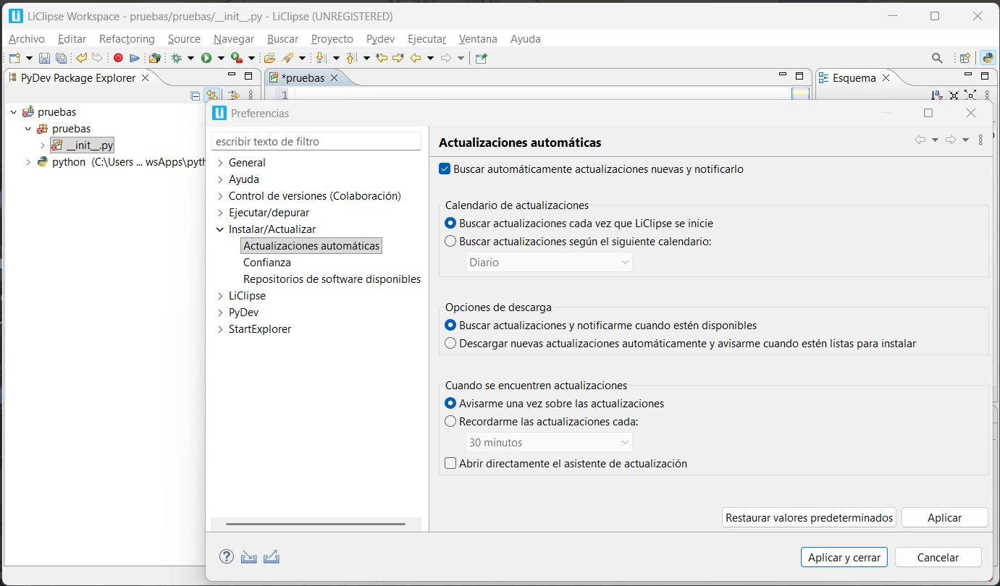

# Punto 4: Configuración del sistema de actualización del entorno de desarrollo

## IDEs utilizados

-  **IDE 1:** IDE propietario **IntelliJ IDEA Ultimate** -
    Versión: IntelliJ IDEA 2025.2.4 -- 21.0.8+1-b1038.73 amd64 (JCEF 122.1.9)

-  **IDE 2:** IDE libre - **LiClipse** - 
    Versión : 12.0.1.202502081502

## Descripción de la tarea

**IntelliJ IDEA Ultimate**

Como verificar si nuestro  **IntelliJ IDEA Ultimate** esta actulizado: 

Abre el Menú de Ayuda: Ve a Help (Ayuda) en la barra de menú superior.

Busca la Opción de Actualización: Haz clic en Check for Updates... (Buscar actualizaciones...).

Resultado: IntelliJ IDEA se conectará con los servidores de JetBrains y te dirá si ya estás usando la versión más reciente o si hay una nueva disponible para el canal de actualización que elegiste.

Como verificar si nuestro  **LiClipse (Versión 12.0.1)**  esta actulizado: 

ayuda > buscar actulizaciones..

## Respuestas a preguntas evaluativas

### Pregunta 1: ¿Cómo configuraste las actualizaciones automáticas en cada IDE?

**IntelliJ IDEA Ultimate (Versión 2025.2.4)**

-   **Accede a Preferencias/Configuración:** En Windows/Linux, suele ser **File** > **Settings**; en macOS, **IntelliJ IDEA** > **Settings** o **Preferences**. 
    
-   **Ve a Apariencia y Comportamiento:** Busca la sección **Appearance & Behavior** o similar.

* **Configuracion del sistema**
    
-   **Encuentra Actualizaciones del Sistema:** Dentro, debería haber una opción como **System Settings** o **System Updates**.
    
-   **Configura el Canal de Actualización:** Puedes elegir qué tipo de actualizaciones quieres recibir (**Stable** para versiones estables, **Beta** para las candidatas a lanzamiento, o **EAP** para acceso anticipado).

**Liclipse**

ventana > preferencias...

Instalar/actualizar > 

Actualizaciones automáticas 

Seleccionar recuadro que dice
 "Buscar automaticamente actualizaciones nuevas y notificarlo" 

### Pregunta 2: ¿Por qué es importante mantener el IDE actualizado en proyectos de desarrollo?

**actualizar tu IDE es vital por tres pilares fundamentales que te hacen mejor desarrollador:**

1.  **Rendimiento y Estabilidad:** Significa que tu herramienta será más **rápida**, con menos **bugs** y, por lo tanto, tendrás menos dolores de cabeza y esperas.
    
2.  **Seguridad Crítica:** Cierra **vulnerabilidades** que podrían ser explotadas, manteniendo a salvo tanto tu código como tu sistema.
    
3.  **Soporte Tecnológico:** Garantiza que el IDE **entienda** las últimas versiones de los lenguajes de programación y te permita usar las **mejores herramientas y _plugins_** del mercado.
    

Es una pequeña inversión de tiempo que se traduce en **mucha eficiencia** y seguridad en tu día a día.

## Evidencias

## Observaciones
[Comentarios adicionales]
