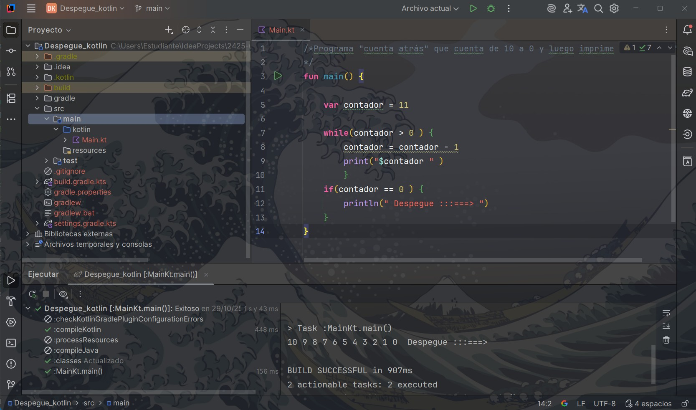
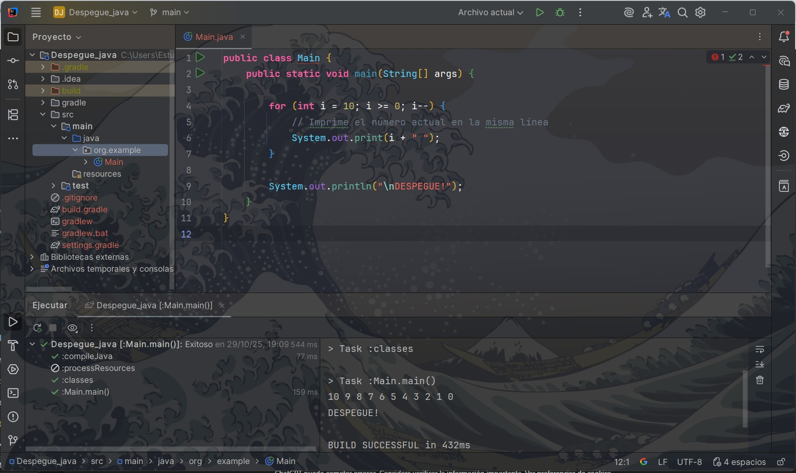

# Punto 5: Generación de ejecutables a partir de código fuente en distintos lenguajes en un mismo IDE

## IDE utilizado

**IDE 1IntelliJ IDEA Ultimate -Versión: IntelliJ IDEA 2025.2.**


## Descripción de la tarea
Programa "cuenta atrás" que cuenta de 10 a 0 y luego imprime "¡Despegue!"

### Lenguajes utilizados
- **Lenguaje 1:** [ej: Java]
- **Lenguaje 2:** [ej: Kotlin]

## Código implementado

### Lenguaje 1: Java
    ```[java]
    [public class Main {
    public static void main(String[] args) {

        for (int i = 10; i >= 0; i--) {
            // Imprime el número actual en la misma línea
            System.out.print(i + " ");
        }

        System.out.println("\nDESPEGUE!");
    }
}
]
    ```

### Lenguaje 2: Kotlin

    kotlin 

    fun main() {

    var contador = 11

    while(contador > 0 ) {
        contador = contador - 1
        println(contador)
        }
    if(contador == 0 ) {
        println("Despegue")

    }

}

## Respuestas a preguntas evaluativas

### Pregunta 1: ¿Cuál fue el proceso para ejecutar el mismo programa en diferentes lenguajes dentro del mismo IDE?

Con **IntelliJ IDEA Ultimate**, comenzar es **sumamente fácil**: solo hay que abrir un nuevo proyecto, seleccionar el **lenguaje** con el que queremos **trabajar**, y **a correr**. El IDE se encarga de todo el proceso de **compilación y ejecución** al dar la opción de **ejecutar**   


### Pregunta 2: ¿Qué diferencias encontraste en la generación del ejecutable entre los dos lenguajes?

ninguna por que como lo realice mendiante el el IDE


## Evidencias





## Observaciones
[Comentarios adicionales]
