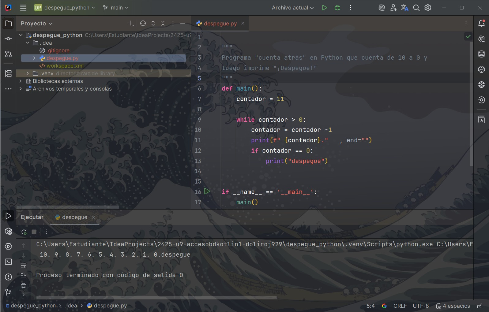
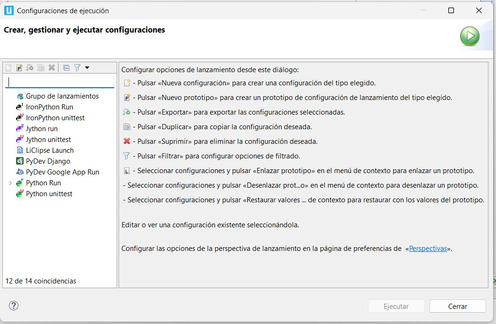
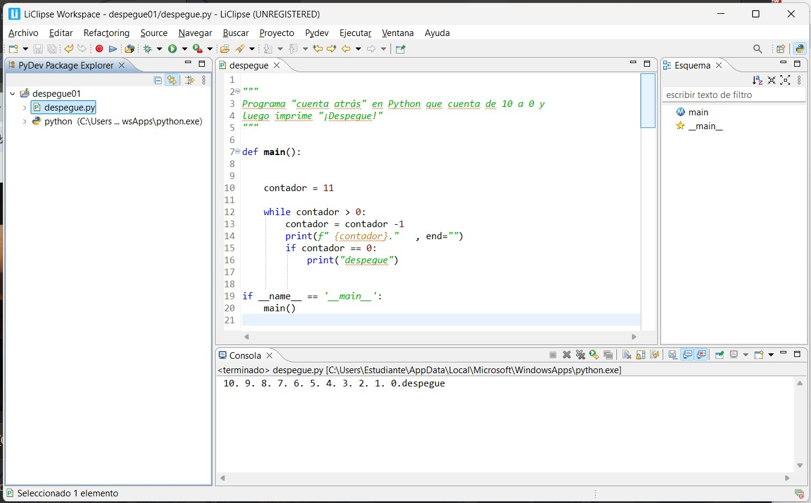

# Punto 6: Generación de ejecutables con diferentes IDEs a partir del mismo código fuente

## IDEs utilizados

-  **IDE 1:** IDE propietario **IntelliJ IDEA Ultimate** -
    Versión: IntelliJ IDEA 2025.2.4 

-  **IDE 2:** IDE libre - **LiClipse** - 
    Versión : 12.0.1.


## Descripción de la tarea
Programa "cuenta atrás" en Python que cuenta de 10 a 0 y luego imprime "¡Despegue!"

## Código implementado

```python
# Código Python del programa cuenta atrás

def main():
    contador = 11

    while contador > 0:
        contador = contador -1
        print(f" {contador}."   , end="")
        if contador == 0:
            print("despegue")


if __name__ == '__main__':
    main()
```

## Respuestas a preguntas evaluativas

### Pregunta 1: ¿Qué diferencias encontraste al ejecutar el mismo código fuente en diferentes IDEs?


> **La principal diferencia que encontré** fue que, al intentar **ejecutar** el código **directamente** en **liclipse**, me pedía **una** configuración de **ejecución**. Esto fue una "sorpresa", ya que los **IDE** que he manejado no suelen pedirlo." 

### Pregunta 2: ¿Cuál de los IDEs te pareció más cómodo o eficiente para ejecutar el código Python o el lenguaje que hayas elegido? ¿Por qué?

> "En términos generales, IntelliJ IDEA Ultimate es un poco más cómodo porque tiene pequeños detalles como la creación de una estructura de carpetas más coherente y se ejecuta directamente sin configuraciones previas, además de tener un entorno un poco más moderno."


## Evidencias


Configuraciones de ejecucion 





## Observaciones

