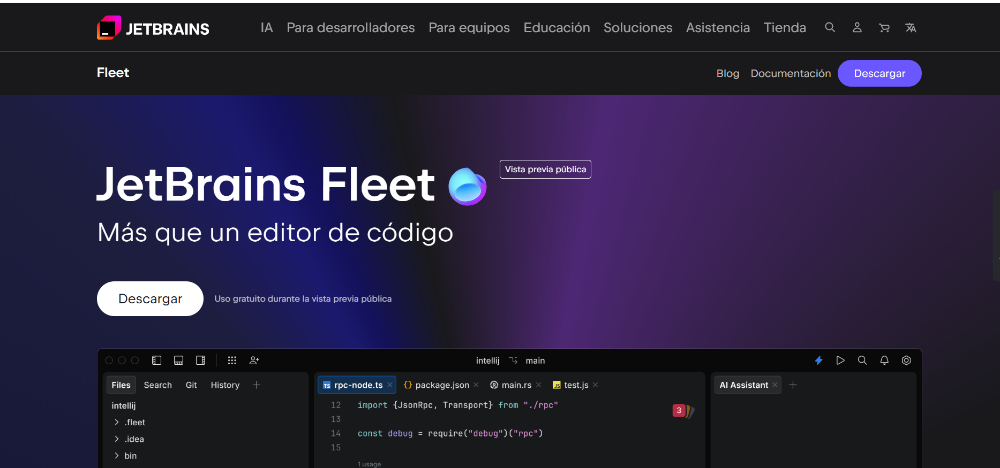
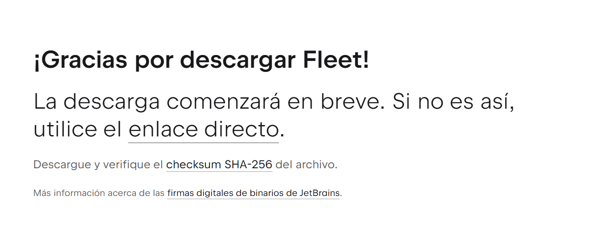

# Punto 1: Instalación de entornos de desarrollo, propietarios y libres

## IDEs utilizados
- **IDE 1:** IntelliJIDEA
- **IDE 2:** [Nombre IDE libre - ej: Visual Studio Code] - Versión X.X.X

## Descripción de la tarea
En este primer punto de esta segunda practica de clase, enseñare paso a paso como instalo dos IDE y comparando las diferencias que tienen la instalación de un IDE libre y uno de propietario.

## Respuestas a preguntas evaluativas

### Pregunta 1: ¿Qué diferencias encontraste en el proceso de instalación entre el IDE propietario y el libre?
**IntelliJ IDEA:**  
Necesita una cuenta de JetBrains y una licencia (yo usare una educativa). La instalación tarda más y pide configurar más opciones, como accesos directos y asociaciones de archivos.

**Visual Studio Code:**  
Se descarga desde su página oficial y se instala rápido. No necesita cuenta ni registro, y ocupa poco espacio.

**Resumen:**  
IntelliJ IDEA es más completo pero tarda más; Visual Studio Code es más rápido y sencillo.

### Pregunta 2: ¿Qué ventajas identificaste en cada uno de los entornos durante la instalación?
**IntelliJ IDEA:** 
Permite personalizar la instalación y tiene funciones avanzadas para proyectos grandes.

**Visual Studio Code:**  
Se instala rápido, es gratuito y se puede ampliar fácilmente con extensiones.

## Evidencias
## IntelijIDEA
- Primero vamos a la pagina de Jetbrains

- Después iniciamos sesión con nuestra cuenta de estudiante en Jetbrains

- Seleccionamos IntelliJ IDEA.

- Descargamos el archivo “.exe” (aproximadamente 1,2 GB).

- Ejecutamos el instalador y configuramos las opciones deseadas (accesos directos, asociaciones de archivos, etc.).

- Esperamos a que se complete la instalación.

- Al finalizar, abrimos el programa y verificamos su funcionamiento.

## Visual Studio Code
- Entramos a la página oficial de Visual Studio Code.

- Hacemos clic en el botón Download.

- Descargamos el instalador y esperamos a que finalice.

- Ejecutamos el archivo “.exe” y seguimos los pasos del asistente y aceptamos los términos de la licencia y seleccionamos las opciones de instalación (crear accesos directos, agregar al PATH, etc.).

- Esperamos a que se complete el proceso.

- Finalmente, abrimos Visual Studio Code.

