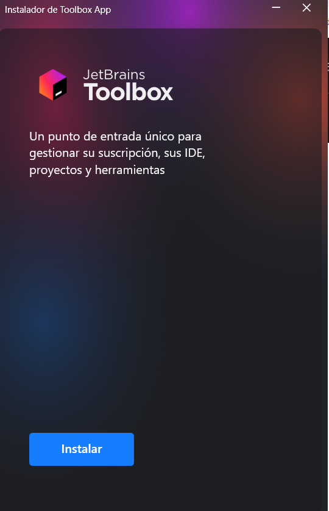

# Punto 1: Instalación de entornos de desarrollo, propietarios y libres

## IDEs utilizados
- **IDE 1:** Jetbrains Fleet 
- **IDE 2:** Visual Studio Code 1.105

## Descripción de la tarea
En este primer punto de esta segunda practica de clase, enseñare paso a paso como instalo dos IDE y comparando las diferencias que tienen la instalación de un IDE libre y uno de propietario.

## Respuestas a preguntas evaluativas

### Pregunta 1: ¿Qué diferencias encontraste en el proceso de instalación entre el IDE propietario y el libre?
**Fleet:**  
Todavia no se necesita una cuenta de JetBrains o una licencia (yo usare una educativa) porque Fleet sigue en periodo de prueba publica pero cuando termine la version publica de prueba pues se necesitara una licencia para descargarlo. La instalación tarda un poco más que VS code, pero no mucho más ya que fleet tambien es bastante ligero.

**Visual Studio Code:**  
Se descarga desde su página oficial y se instala rápido. No necesita cuenta ni registro, y ocupa poco espacio.

### Pregunta 2: ¿Qué ventajas identificaste en cada uno de los entornos durante la instalación?
**Fleet:** 
La instalación fue bastante rápida y solo falataria instalarle plugins en el siguiente punto .

**Visual Studio Code:**  
Se instala rápido, es gratuito y se puede ampliar fácilmente con extensiones.

## Evidencias
## Fleet
- Primero vamos a la pagina de Jetbrains

- Después iniciamos sesión con nuestra cuenta de estudiante en Jetbrains

- Seleccionamos Fleet.

- Descargamos la toolbox de jetbrains

- Instalamos fleet

- Aceptamos los terminos de usuario.

- Al finalizar, abrimos el programa y verificamos su funcionamiento.

## Visual Studio Code
- Entramos a la página oficial de Visual Studio Code.

- Hacemos clic en el botón Download.

- Descargamos el instalador y esperamos a que finalice.

- Ejecutamos el archivo “.exe” y seguimos los pasos del asistente y aceptamos los términos de la licencia y seleccionamos las opciones de instalación (crear accesos directos, agregar al PATH, etc.).

- Esperamos a que se complete el proceso.

- Finalmente, abrimos Visual Studio Code.

