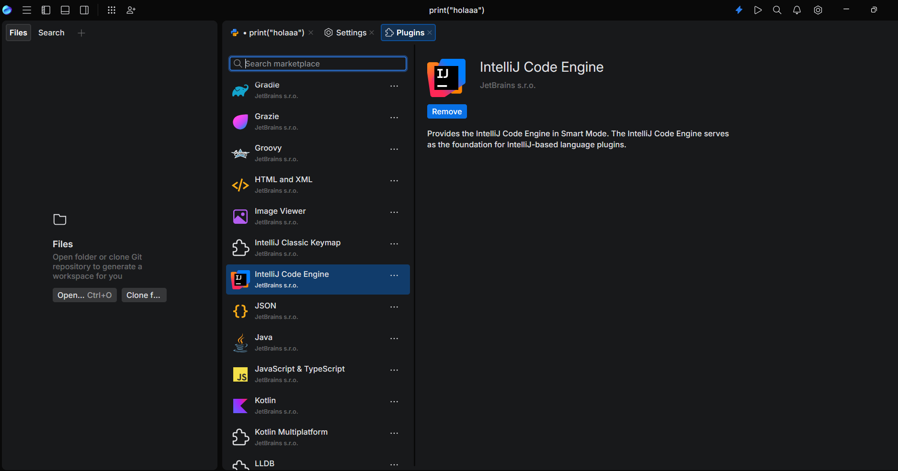
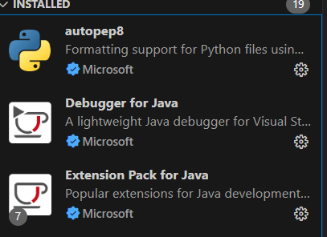

# Punto 2: Gestión de módulos y extensiones en el entorno de desarrollo

## IDEs utilizados
- **IDE 1:** Jetbrains Fleet
- **IDE 2:** Visual Studio Code 1.105

## Descripción de la tarea
Instalare las extensiones:
En Fleet: Intelij Idea Engine.
En Visual Studio Code: autopep8, debugger for java y un extension pack for java

## Respuestas a preguntas evaluativas

### Pregunta 1: ¿Cómo fue el proceso de instalación de extensiones o módulos en cada IDE?
**Fleet**
En la barra superior de ajustes y en plugins busqué las herramientas que necesitaba, pero la aplicacion al tener todos los plugins de su marketplace instalados por defecto pues no he podido instalar ninguno nuevo y el que he visto mas interesante es motor de intelij idea.
**Visual Studio Code**
En la pestaña Extensiones, busqué cada una por su nombre y pulsé instalar. La instalación fue rápida y no hizo falta reiniciar el programa.

### Pregunta 2: ¿Qué beneficios proporcionan las extensiones o plugins que instalaste para el desarrollo de tus proyectos?
**Fleet**
Las extensiones me permiten trabajar con diferentes lenguajes y mejorar la calidad del código y tiene plugins para la mayoria de lenguajes más usados.

**Visual Studio Code**
autopep8 da formato automático al código, debugger for java permite depurar programas y extension pack for java añade soporte completo para trabajar con java.

## Evidencias
- Fleet

- Visual Studio Code

