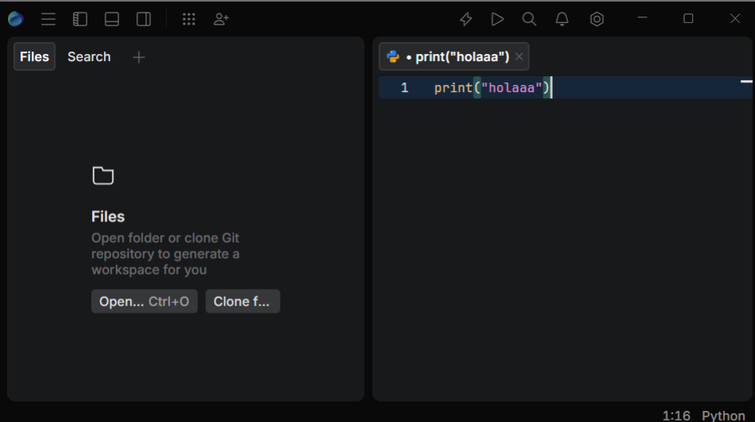
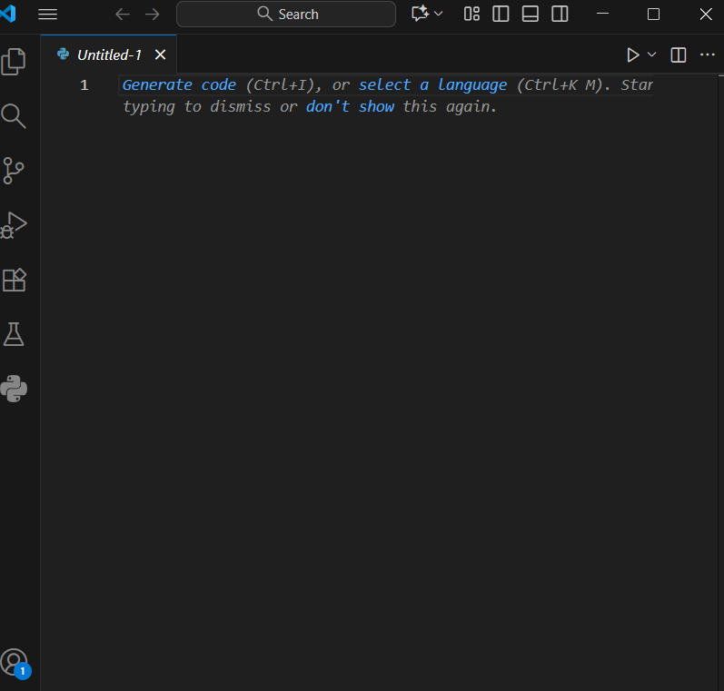
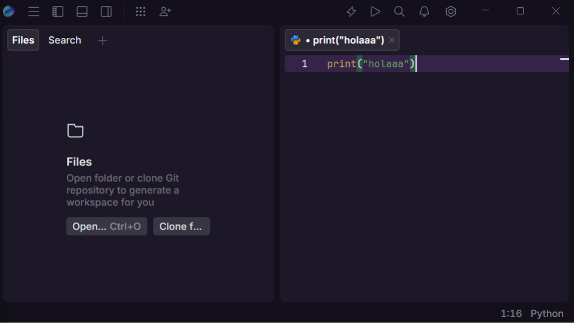
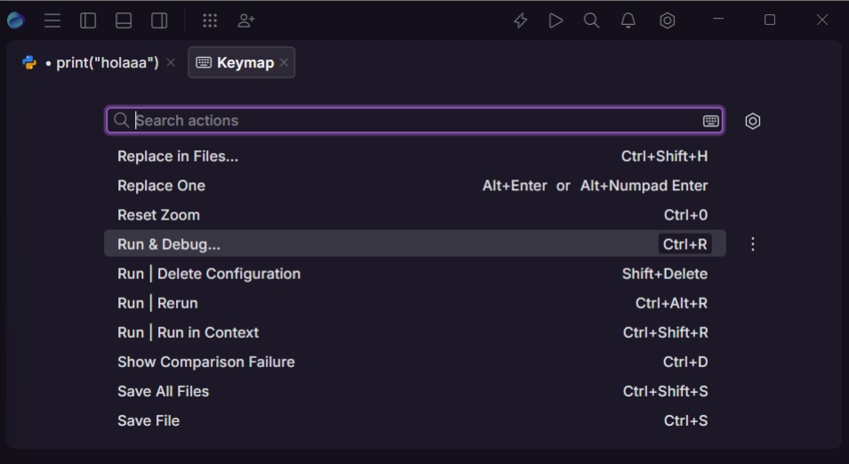
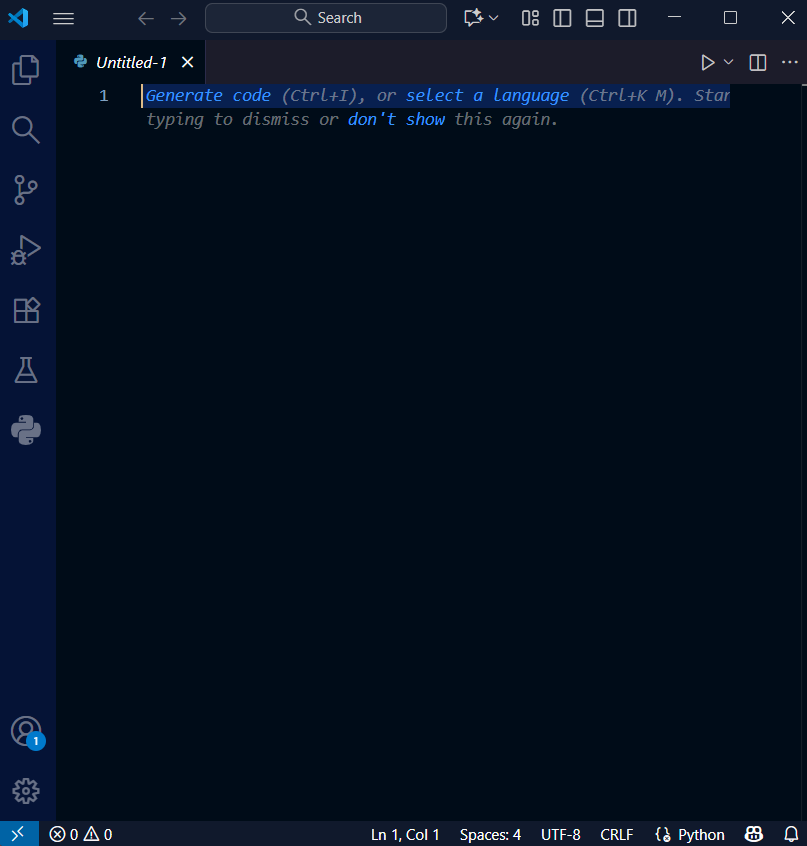
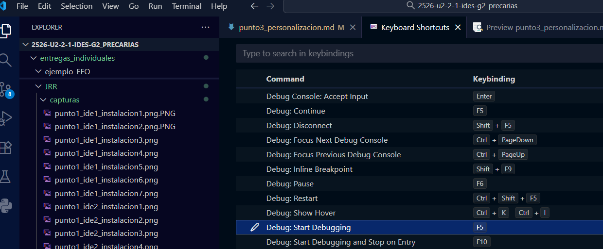
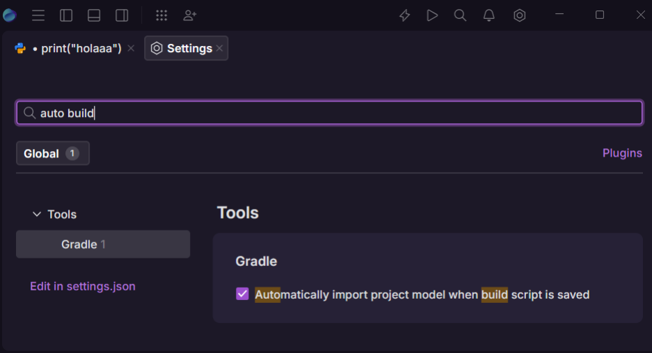
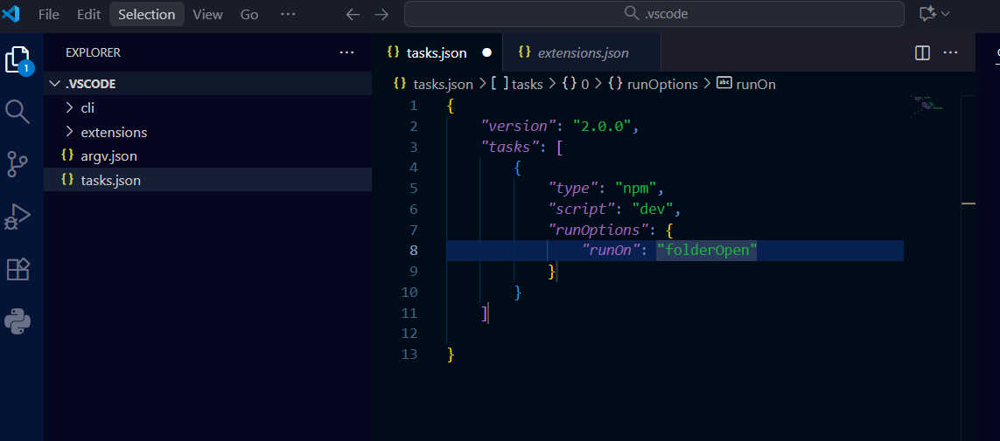

# Punto 3: Personalización y automatización del entorno

## IDEs utilizados
- **IDE 1:** jetbrains Fleet
- **IDE 2:** Vissual Studio Code 1.105

## Descripción de la tarea
Cambie el tema y los puse los dos oscuros, puse atajos para ejecutar el codigo y ()

### Personalizaciones realizadas
**Fleet**
- Tema:Dark Purple
- Atajos de teclado: 
- Automatización: compilar al guardar

**VS Code**
- Tema: Abyss
- Atajos de teclado: F5 para ejecutar
- Automatización: 

## Respuestas a preguntas evaluativas

### Pregunta 1: ¿Qué aspectos del entorno personalizaste y cómo mejoró tu experiencia de desarrollo?
**Fleet**
Cambié el tema al modo oscuro Dark Purple para trabajar más cómodo, porque me gusta más. También configuré atajos como Ctrl + r para ejecutar el proyecto.

**Visual Studio Code**
Usé el tema Abyss y configuré los atajos F5 para ejecutar.
Estas personalizaciones hicieron el entorno más bonito y más comodo para ejecutar los codigos.

### Pregunta 2: ¿Cómo configuraste la automatización de tareas y en qué te benefició durante el trabajo?
**Fleet** 
Activé la opción de auto build, que compila automáticamente el proyecto cuando se guardan los cambios.

**Visual Studio Code** 
Añadí tareas personalizadas en el archivo tasks.json para compilar y ejecutar programas automáticamente.
## Evidencias
**ANTES:**

**DESPUÉS:**

**AUTOMATIZACIÓN:**

