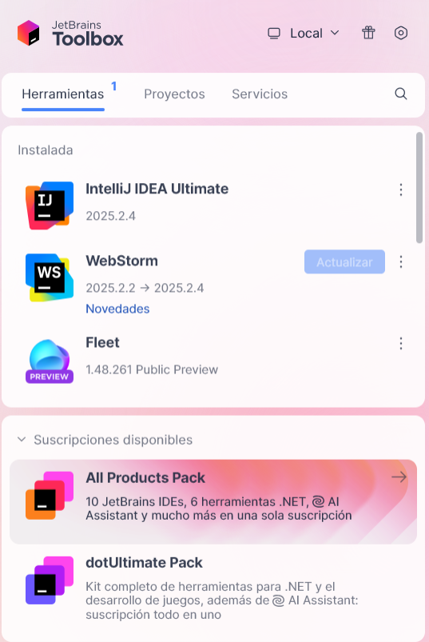
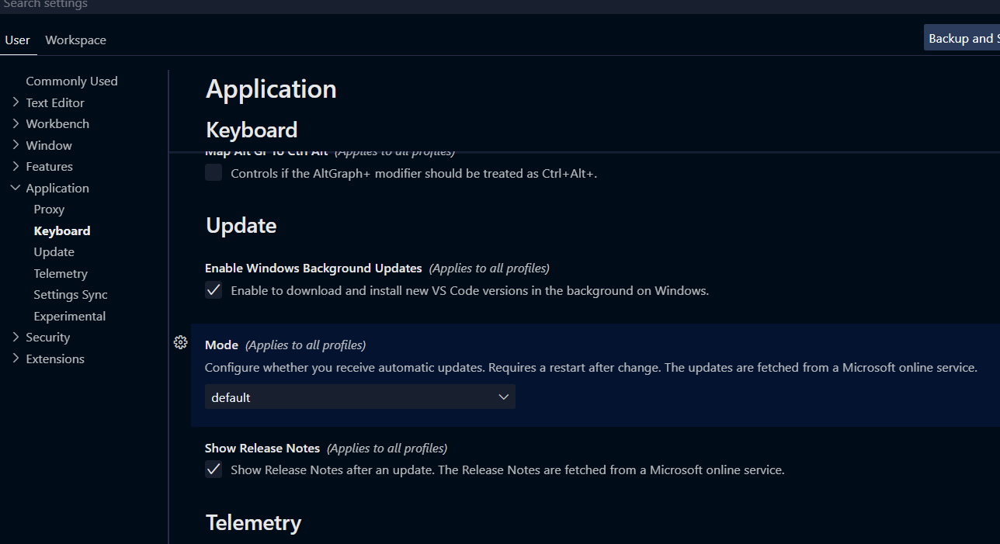

# Punto 4: Configuración del sistema de actualización del entorno de desarrollo

## IDEs utilizados
- **IDE 1:** jetbrains Fleet
- **IDE 2:** Visual Studio Code 1.105

## Descripción de la tarea
Configuré las actualizaciones automáticas en ambos IDEs para tener siempre las últimas mejoras y evitar problemas de compatibilidad o seguridad

## Respuestas a preguntas evaluativas

### Pregunta 1: ¿Cómo configuraste las actualizaciones automáticas en cada IDE?
**Fleet** 
Desde el toolbox de jetbrains te avisa cuando hay una actualizacion, para que la instales.

**Visual Studio Code**
Abrí Settings, busqué “update” y dejé activada la opción de actualizaciones automáticas. Así, el programa se actualiza solo cuando hay una nueva versión.

### Pregunta 2: ¿Por qué es importante mantener el IDE actualizado en proyectos de desarrollo?
Es importante porque las actualizaciones corrigen errores, mejoran el rendimiento y añaden funciones nuevas.
Además, ayudan a que el IDE sea más seguro y compatible con las últimas versiones de los lenguajes y extensiones.

## Evidencias

