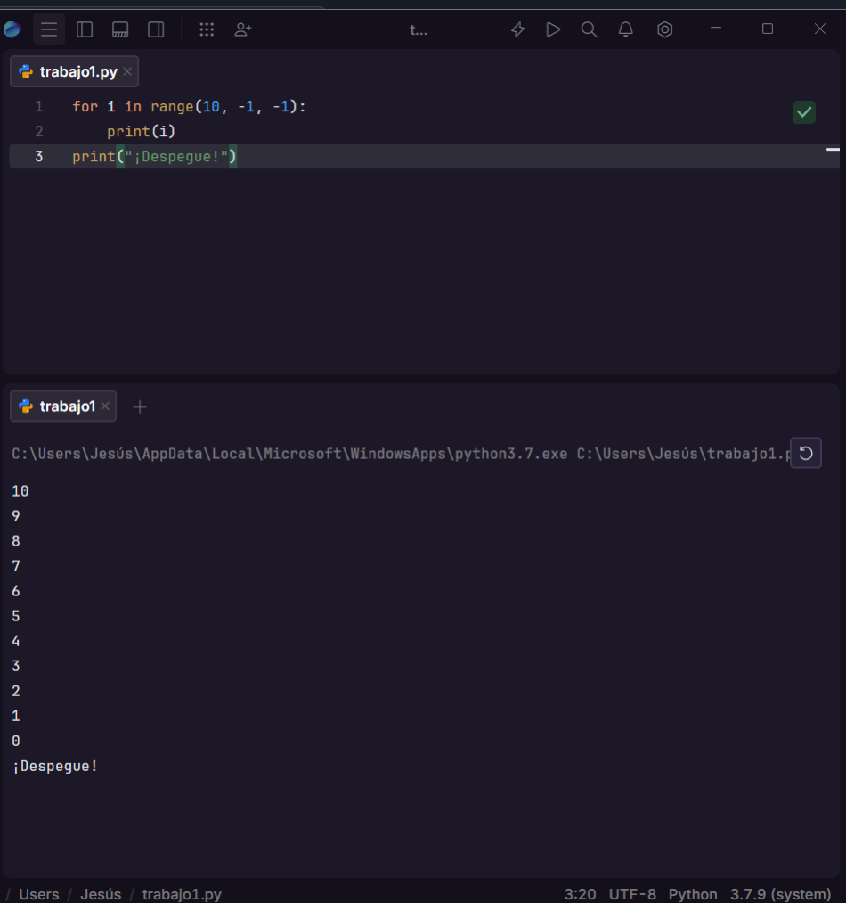
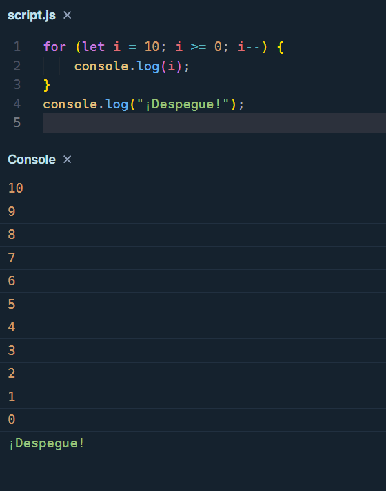

# Punto 5: Generación de ejecutables a partir de código fuente en distintos lenguajes en un mismo IDE

## IDE utilizado
- **IDE:** Fleet

## Descripción de la tarea
Programa "cuenta atrás" que cuenta de 10 a 0 y luego imprime "¡Despegue!"

### Lenguajes utilizados
- **Lenguaje 1:**Python
- **Lenguaje 2:**javascript

## Código implementado

### Lenguaje 1: [Python]
```[Python]
[for i in range(10, -1, -1):
    print(i)
print("¡Despegue!")
]
```

### Lenguaje 2: [javascript]
```[javascript]
[for (let i = 10; i >= 0; i--) {
    console.log(i);
}
console.log("¡Despegue!");

]
```

## Respuestas a preguntas evaluativas

### Pregunta 1: ¿Cuál fue el proceso para ejecutar el mismo programa en diferentes lenguajes dentro del mismo IDE?
En Fleet creé dos archivos: uno con extensión .py y otro .js.
El IDE detectó automáticamente el lenguaje de cada archivo.
Ejecuté el programa de Python directamente, y el de JavaScript haciendo un archivo run.json.
### Pregunta 2: ¿Qué diferencias encontraste en la generación del ejecutable entre los dos lenguajes?
Python se ejecuta directamente sin necesidad de compilar, ya que es un lenguaje interpretado.
JavaScript también se interpreta, pero normalmente se ejecuta dentro de un navegador o con run.json.
Ambos lenguajes permiten ver resultados de forma rápida, aunque Python se usa más para scripts y JavaScript para la web.

## Evidencias


