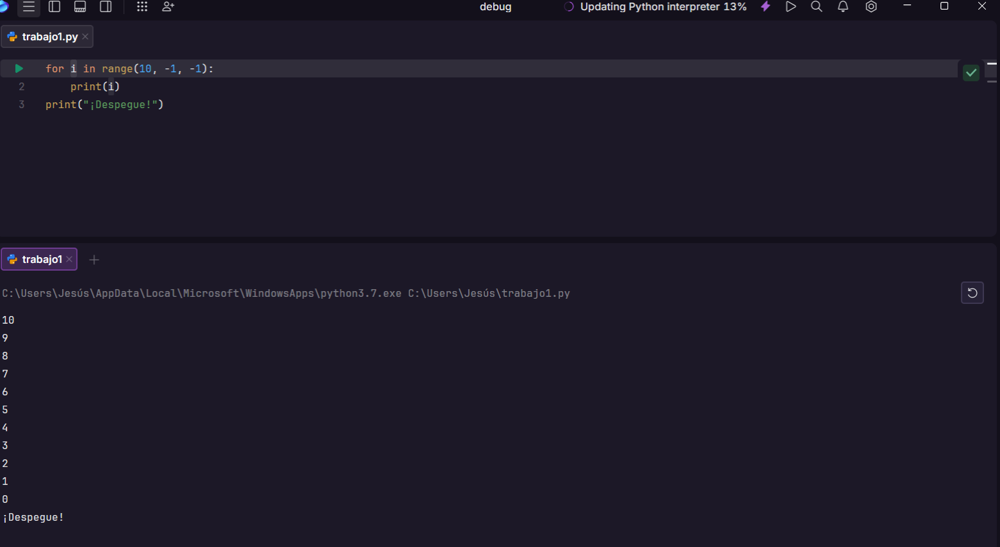
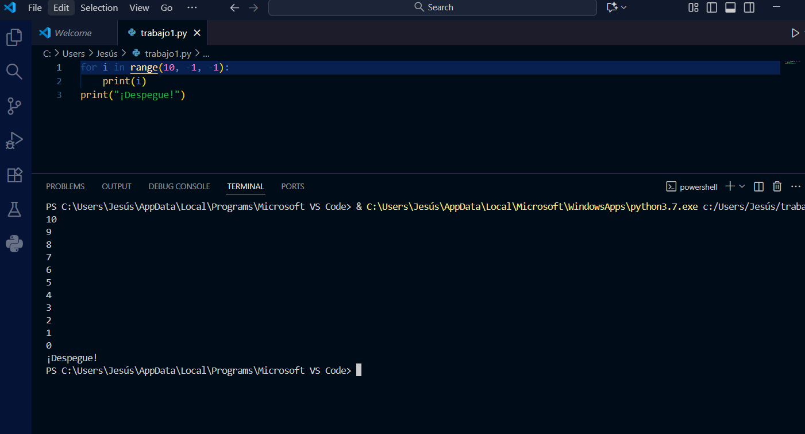

# Punto 6: Generación de ejecutables con diferentes IDEs a partir del mismo código fuente

## IDEs utilizados
- **IDE 1:** Fleet
- **IDE 2:** Visual Studio Code 1.105

## Descripción de la tarea
Programa "cuenta atrás" en Python que cuenta de 10 a 0 y luego imprime "¡Despegue!"

## Código implementado

```python
# Código Python del programa cuenta atrás
[for i in range(10, -1, -1):
    print(i)
print("¡Despegue!")]
```

## Respuestas a preguntas evaluativas

### Pregunta 1: ¿Qué diferencias encontraste al ejecutar el mismo código fuente en diferentes IDEs?
**Fleet**
El programa se ejecutó directamente con el botón Run, sin tener que configurar nada extra.
**Visual Studio Code**
Fue necesario tener instalado Python y la extensión oficial de Microsoft para poder ejecutarlo desde el terminal o con el botón de ejecución.
**Resummen**
Ambos funcionaron bien, pero Fleet fue un poco más rápido y automático.

### Pregunta 2: ¿Cuál de los IDEs te pareció más cómodo o eficiente para ejecutar el código Python o el lenguaje que hayas elegido? ¿Por qué?
Me pareció más cómodo Fleet, porque detecta el lenguaje automáticamente y ejecuta el código sin necesidad de ajustes.
Visual Studio Code también es muy bueno, pero requiere configurar las extensiones y el intérprete antes de ejecutar.
Para proyectos pequeños y pruebas rápidas, Fleet es más simple y ágil.

## Evidencias


