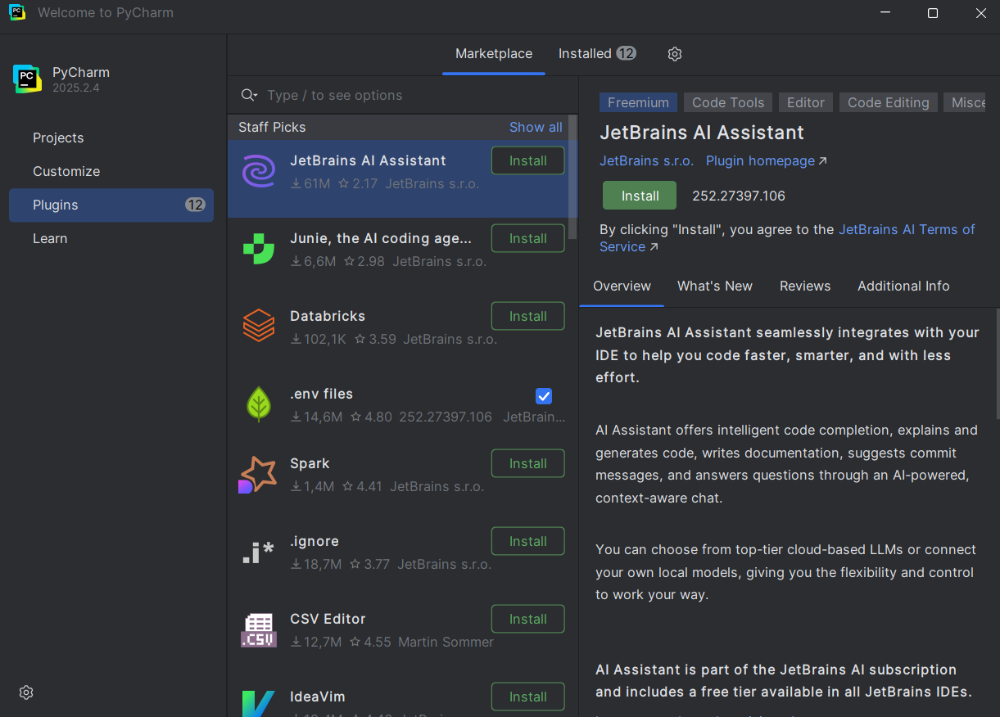
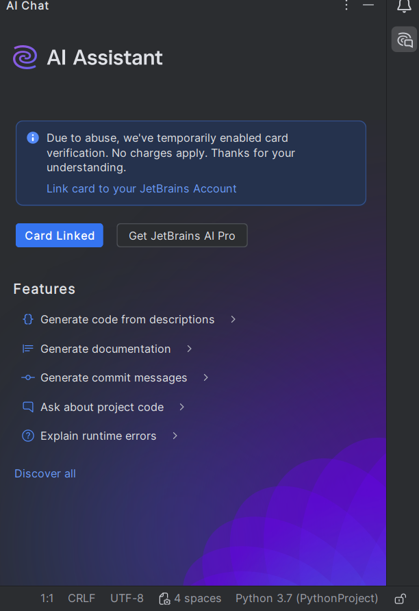
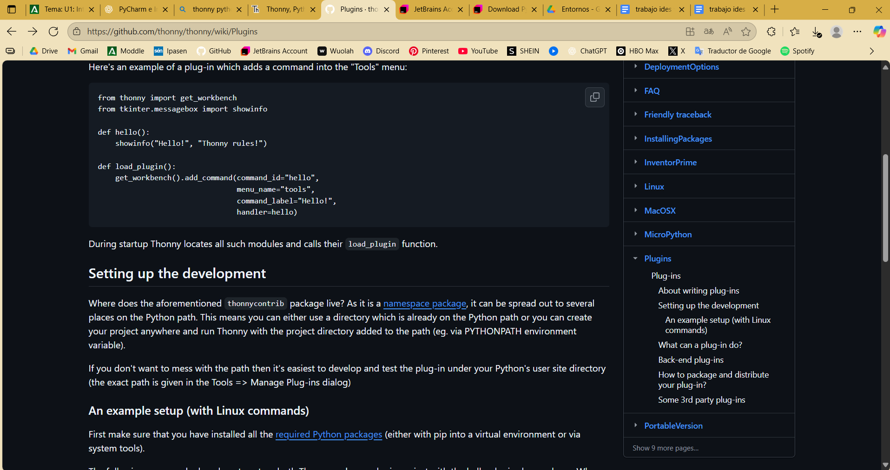
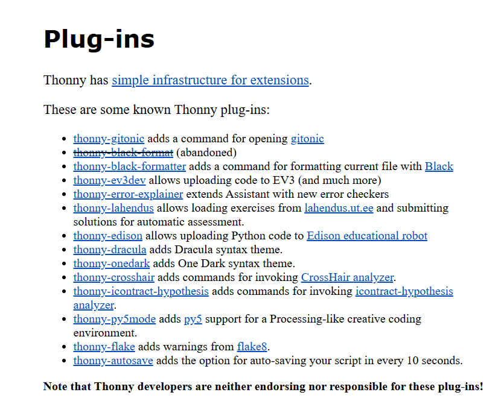
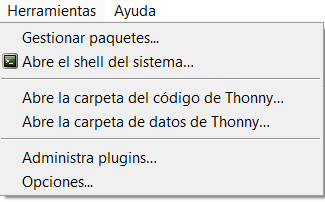
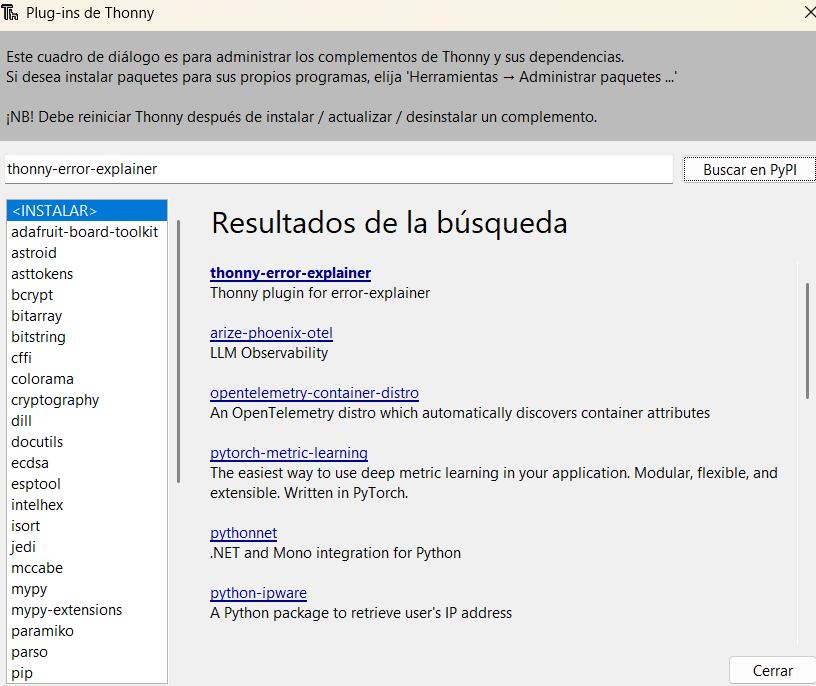
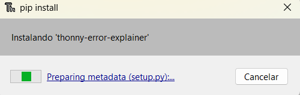
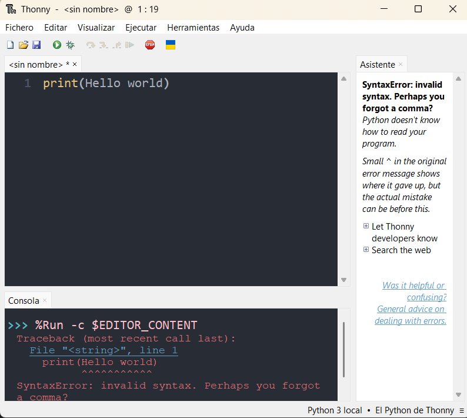

# Punto 2 Gestión de módulos y extensiones en el entorno de desarrollo (CE 2.b)

## IDEs utilizados:
- **IDE 1:** PyCharm2.4
- **IDE 2:** Thonny4.1.7

## Descripción de la tarea
Agregar extensiones o plugins a los distintos IDEs

# Respuestas a preguntas evaluativas 
### Pregunta 1: ¿Cómo fue el proceso de instalación de extensiones o módulos en cada IDE?
**PyCharm:**
En PyCharm, la instalación de extensiones se realiza a través del Marketplace de plugins integrado en el IDE (File -> Settings -> Plugins -> Marketplace). Para instalar JetBrains AI Assistant, simplemente busqué el plugin por nombre, pulsé Install y reinicié el IDE. El Marketplace facilita ver qué plugins están disponibles, instalarlos, actualizarlos y desactivarlos desde una misma interfaz, haciendo el proceso más rápido y visual.

**Thonny:**
En Thonny no existe un catálogo de plugins integrado dentro del IDE, por lo que no se puede navegar por una lista de extensiones como en otros IDEs. Para instalar thonny-error-explainer, primero tuve que buscar información externa en la página oficial de Thonny y en PyPi para encontrar algún plugin disponible. Luego lo instalé usando Herramientas -> Gestionar paquetes..., escribiendo el nombre del paquete y pulsando Instalar. Tras la instalación fue necesario reiniciar Thonny para que la extensión se activara correctamente. Este proceso es más manual y requiere conocer previamente el nombre del plugin que se quiere usar.

### Pregunta 2: ¿Qué beneficios proporcionan las extensiones o plugins que instalaste para el desarrollo de tus proyectos?
**PyCharm:** JetBrains AI Assistant
Permite generar código automáticamente a partir de instrucciones en lenguaje natural, explica fragmentos de código, sugiere mejoras y corrige errores. Esto acelera la programación, ayuda a aprender buenas prácticas y facilita la comprensión de código complejo, lo que aumenta significativamente la eficiencia al desarrollar proyectos

## Imagenes del proceso:
### Proceso en PyCharm:
- Nos diriguimos al apartado de plugins, seleccionamos el que nos sea de interes y descargamos

- Veremos ahora que al hacer click derecho nos da la opción de usar la extensión

- A la derecha del código saldrá la extensión y sus funciones para configurar

### Proceso en Thonny:
- Vamos a la página oficial de Thonny

- Buscamos el enlace a los plugins

- Observamos los plugins y vemos cual nos es de interes

- Vamos a las herramientas del programa Thonny

- Le damos a administrar plugins y buscamos el que nos ha sido de interes

- Lo instalamos

- Lo probamos escribiendo algo mal en el código
