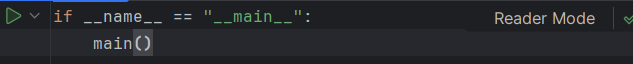
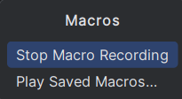
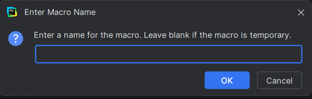
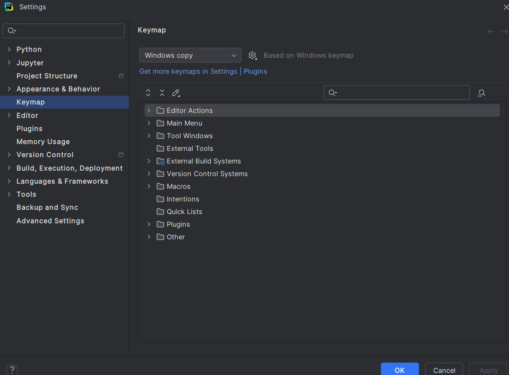
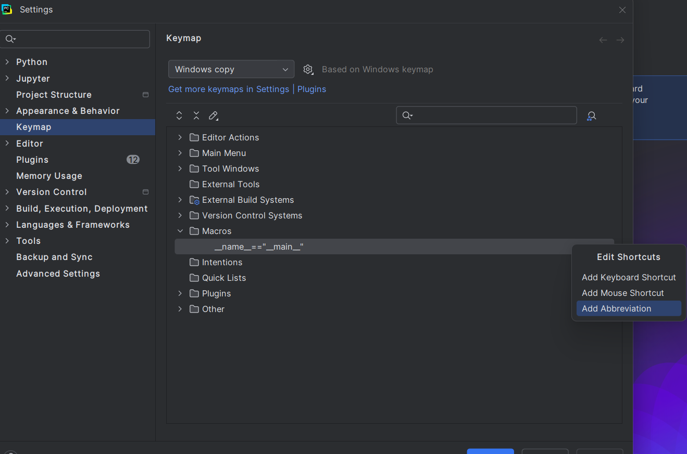
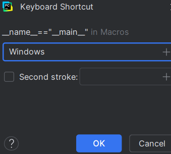
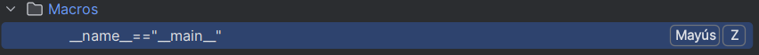

# Punto 3 Personalización y automatización del entorno (CE 2.c)

## IDEs utilizados:
- **IDE 1:** PyCharm2.4
- **IDE 2:** Thonny4.1.7

## Descripción de la tarea
Personalizar el entorno de trabajo en cada IDE (tema, atajos de teclado) y automatizar una tarea

# Respuesta a preguntas evaluativas
### Pregunta 1: ¿Qué aspectos del entorno personalizaste y cómo mejoró tu experiencia de desarrollo?
**PyCharm:**
Personalicé los atajos de teclado para automatizar tareas que realizo con frecuencia en todos mis archivos. En concreto, creé un atajo que inserta automáticamente la estructura básica del bloque:
```python
if __name__ == "__main__":
    main()
```
Este bloque se utiliza para inicializar el main en Python.

Esta personalización me permitió ahorrar algo de tiempo, ya que no tengo que escribirlo manualmente cada vez que creo un nuevo archivo o script.

**Thonny:**
Personalicé principalmente el tema del editor. Cambié el tema de colores a un estilo oscuro usando la opción Herramientas -> Opciones -> Editor -> Tema. Thonny no tiene demasiadas herramientas de personalización, los atajos están predefinidos y no se pueden modificar desde la interfaz. Sin embargo, pude instalar también plugins para cambiar el tema por uno oscuro, lo que reduce la fatiga visual y facilita distinguir la sintaxis de python.

### Pregunta 2: ¿Cómo configuraste la automatización de tareas y en qué te benefició durante el trabajo?
**PyCharm:**
Para la automatización utilicé la herramienta de Macros de PyCharm: grabé un macro en el que escribía automáticamente el bloque ya mencionado, y luego le asigné un atajo del teclado personalizado para ejecutarlo siempre que quiera. Me beneficio al simplificar una tarea repetitiva y estandarizar la estructura de mis archivos en Python.

**Thonny:**
No es posible, en este IDE, automatizar tareas de forma nativa; cualquier automatización requiere de la instalación de un plugin externo. Instalé, para probarlo, el plugin thonny-autosave mediante Herramientas -> Gestionar paquetes..., el cual permite guardar automáticamente el script cada cierto tiempo.

## Imagenes del proceso:
### Proceso en PyCharm:
- Buscamos la opción de "Macros" (con el buscador de palabras) y empezamos la grabación

- Escribimos el código que queremos que se grabe en el Macro

- Paramos la grabación una vez hemos escrito todo el código que deseabamos

- Ponemos nombre a la macro

- Buscamos la opción Keymap y vamos al apartado Macros. Buscamos el macro que acabamos de hacer y le damos a "Add Keyboard Shortcut"


- Añadimos las teclas que vamos a usar para el atajo

- Guardamos la macro y se nos crea automáticamente un atajo de teclado con las teclas que hayamos introducido


### Proceso en Thonny:
- Como thonny no permite muchas opciones de configuración, repitiendo los pasos del módulo 2, buscamos alguna extensión que nos ayude con la automatización de alguna tarea y lo instalamos
