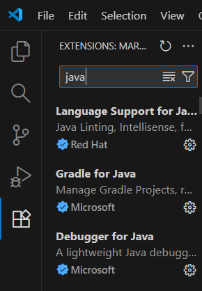
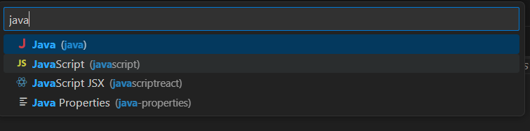
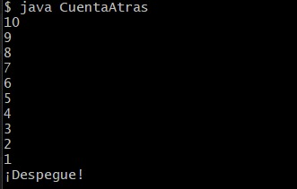
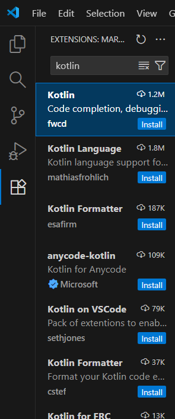
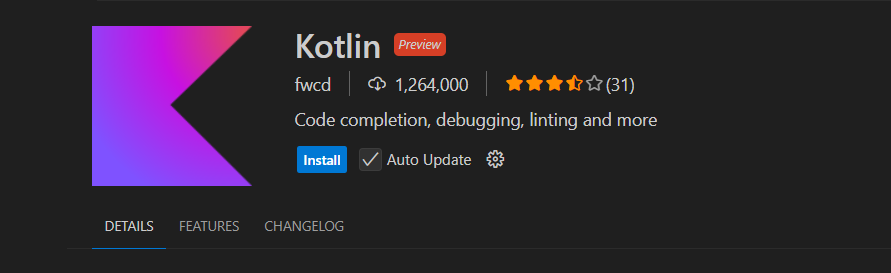
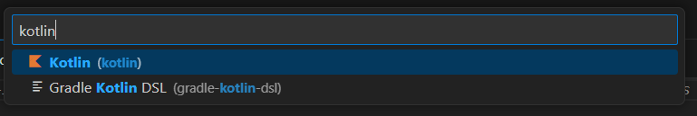
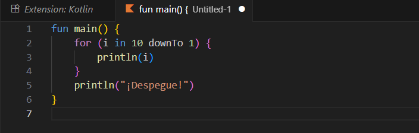
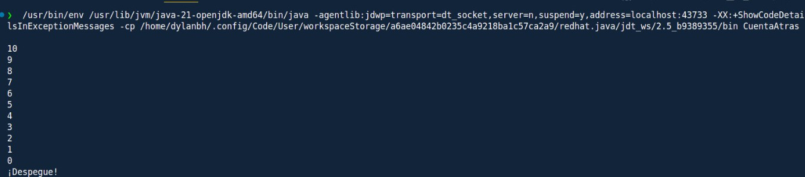

# Punto 5 Generación de ejecutables a partir de código fuente en distintos lenguajes en un mismo IDE (CE 2.e)

## IDE utilizado:
Como Thonny y PyCharm (los IDEs que habia estado utilizando) no dan opción a otro lenguaje distinto a Python, he decidido utilizar Visual Studio Code, ya que me ofrece las herramientas necesarias para poder hacer ambos códigos.

## Descripción de la tarea
Escribir un programa que cuente de 10 a 0 y luego imprima "¡Despegue!" usando un único IDE para generar y ejecutar este programa en dos lenguajes diferentes. En mi caso, haré Java y Kotlin

# Respuesta a preguntas evaluables
### Pregunta 1: ¿Cuál fue el proceso para ejecutar el mismo programa en diferentes lenguajes dentro del mismo IDE?
Creé en Visual Studio Code dos archivos separados: uno en Java y otro en Kotlin. Para poder trabajar con ambos lenguajes, instalé las extensiones correspondientes a cada uno.
El objetivo del programa era contar de 10 a 0 y mostrar “¡Despegue!”.

En el caso de Java, el proceso fue compilar el archivo .java con el comando javac, lo que generó un archivo .class con el bytecode. Luego, ejecuté el programa con el comando java.

En Kotlin, utilicé el compilador kotlinc, que traduce el archivo .kt también a bytecode compatible con la JVM. Posteriormente, se puede ejecutar con el comando java -jar si se genera un .jar, o directamente desde el compilador.

De esta forma, ambos lenguajes pudieron ejecutarse dentro del mismo IDE y sobre la misma plataforma, la Java Virtual Machine (JVM).

### Pregunta 2: ¿Qué diferencias encontraste en la generación del ejecutable entre los dos lenguajes?
En Java, el proceso de compilación y ejecución ocurre en dos pasos:

- El compilador javac convierte el código fuente (.java) en bytecode, guardado en un archivo .class.
- Luego, el comando java ejecuta ese bytecode dentro de la JVM.

En Kotlin, el compilador kotlinc realiza un proceso similar: traduce el código del archivo .kt a Java bytecode, pero ofrece la opción de generar directamente un archivo .jar ejecutable.

En resumen, ambos lenguajes generan el mismo tipo de bytecode que interpreta la JVM, pero Kotlin simplifica el proceso al permitir crear y ejecutar el programa en menos pasos, integrando la compilación y empaquetado de manera más automática.

## Imagenes del proceso:
### Proceso en Java:
- Buscamos la extensión de Java

- Instalamos dicha extensión

- Creamos un nuevo documento en el lenguaje Java

- Implementamos el código

- Ejecutamos el código

### Proceso en Kotlin:
- Buscamos la extensión de Kotlin

- Instalamos dicha extensión

- Creamos un nuevo documento en el lenguaje Java

- Implementamos el código

- Ejecutamos el código

