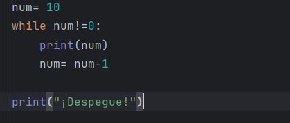
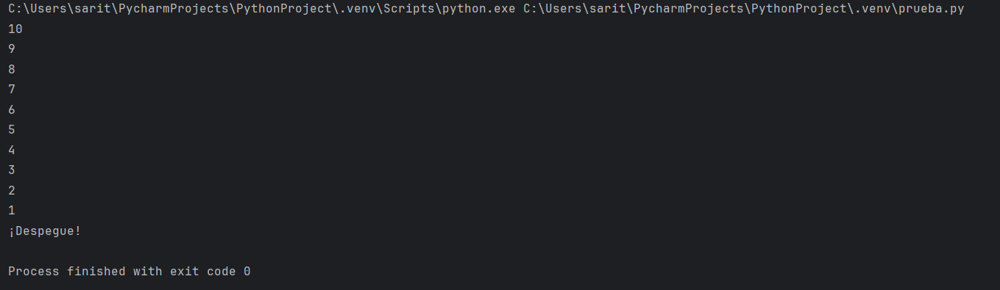
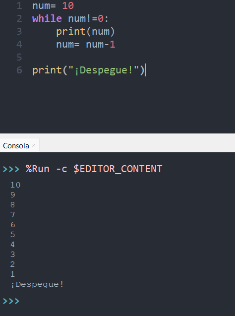

# Punto 6 Generación de ejecutables con diferentes IDEs a partir del mismo código fuente (CE 2.f)

## IDE's utilizado:
- **IDE 1:** PyCharm2.4
- **IDE 2:** Thonny4.1.7

## Descripción de la tarea
Escribir un programa que cuente de 10 a 0 y luego imprima "¡Despegue!" usando un único IDE para generar y ejecutar este programa en python en ambos IDE's seleccionados

# Respuestas a preguntas evaluables
### Pregunta 1: ¿Qué diferencias encontraste al ejecutar el mismo código fuente en diferentes IDEs?
Al ejecutar el mismo código en PyCharm y en Thonny no hubo diferencias en el resultado final del programa, ya que ambos IDEs ejecutan el código Python de la misma manera. En ambos casos, el programa mostró los números del 10 al 1 en orden descendente y luego el mensaje "¡Despegue!"

Sin embargo, sí hubo diferencias en la experiencia de ejecución:
- En Thonny: ejecución simple y derecta. Se presiona el botón "Run" y el programa se ejecuta con la consola integrada

- En PyCharm: ejecución algo más compleja pues muestra más información (por ejemplo, la ruta del archivo) y la consola tiene más funciones, por lo que puede tardar un poco más en iniciar el programa.

### Pregunta 2: ¿Cuál de los IDEs te pareció más cómodo o eficiente para ejecutar el código Python o el lenguajes que hayas elegido? ¿Por qué?

El IDE que me pareció más cómodo y eficiente fue Thonny principalmente porque es más ligero, rápido y fácil de usar especialmente para programas sencillos como el que se probó Permite centrarse en el código y su ejecución sin distracciones.

Sin embargo, PyCharm resulta más potente y completo si se trabaja en proyectos más grandes, ya que ofrece herramientas de depuración avanzadas, autocompletado más inteligente y control de versiones.

Para este ejercicio en particular, Thonny fue el más cómodo, pero PyCharm sería mejor para desarrollos más complejos

## Imagenes del proceso:
### Proceso en PyCharm:

### Proceso en Thonny:

